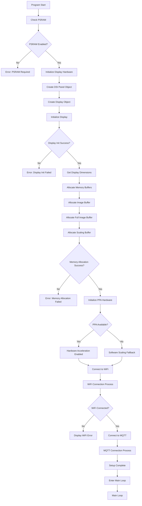
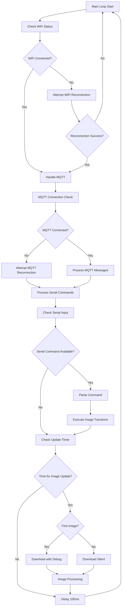
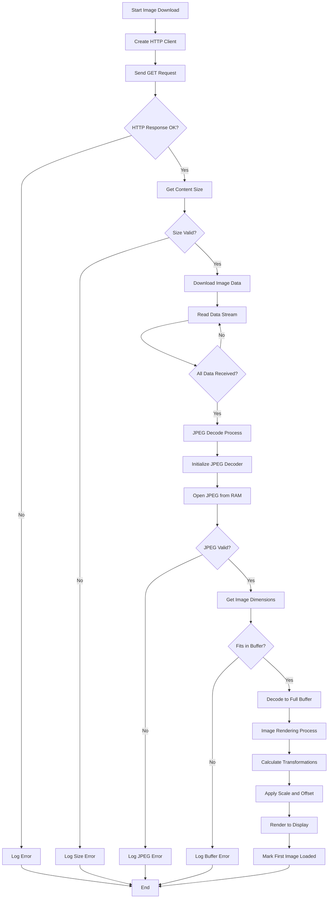
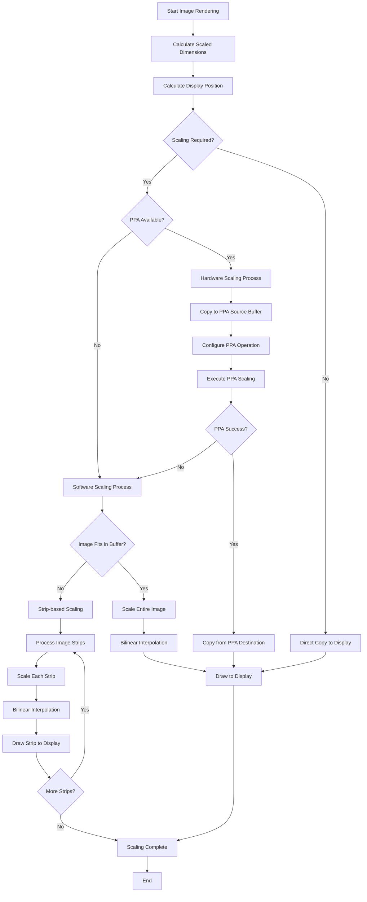
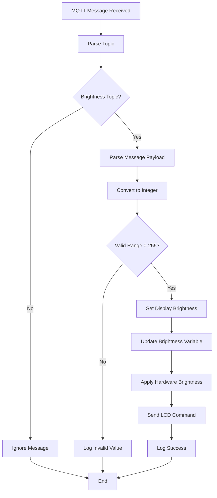
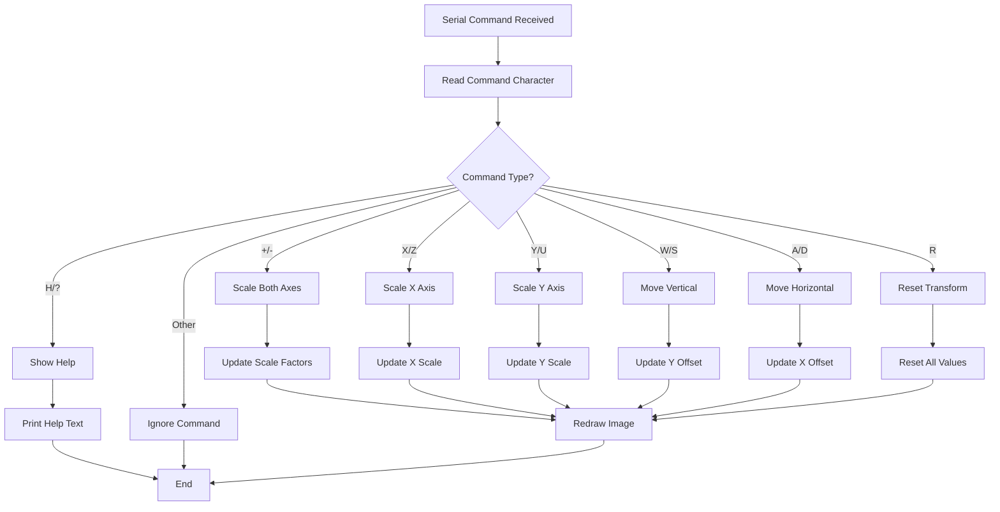
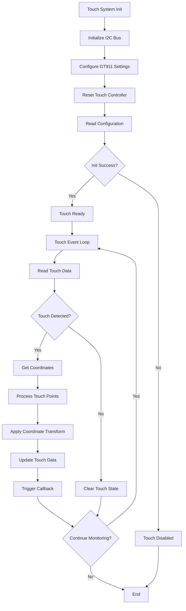
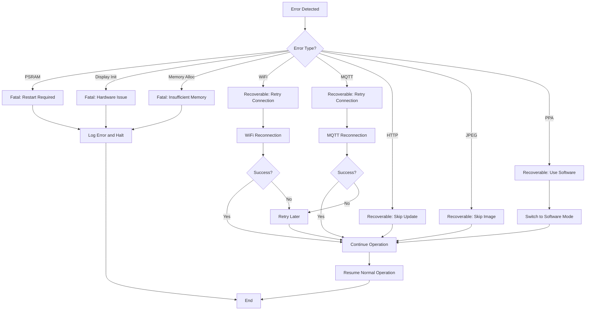
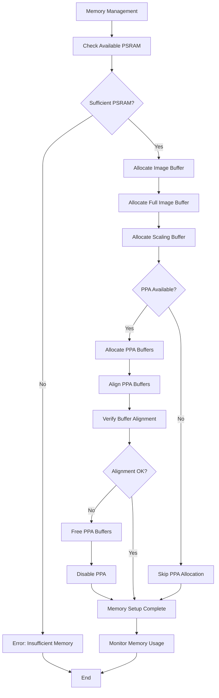

# ESP32-P4 Allsky Display - Logical Flow Chart

This document contains the logical flow chart for the ESP32-P4 Allsky Display project, showing the program execution flow and decision points.

## Main Program Flow

## Main Loop Flow

## Image Download and Processing Flow

## Image Rendering and Scaling Flow

## MQTT Message Handling Flow

## Serial Command Processing Flow

## Touch Interface Flow (GT911)

## Error Handling and Recovery Flow

## Memory Management Flow

## Key Decision Points and States

### Critical System States
1. **Initialization Phase**: Hardware setup and memory allocation
2. **Connection Phase**: WiFi and MQTT establishment
3. **Operational Phase**: Image downloading and display
4. **Error Recovery**: Handling failures and reconnections

### Performance Optimizations
1. **Hardware Acceleration**: PPA usage for image scaling
2. **Memory Management**: PSRAM utilization for large buffers
3. **Streaming**: Progressive image download and processing
4. **Caching**: Full image buffer for smooth transformations

### Error Recovery Mechanisms
1. **Connection Recovery**: Automatic WiFi/MQTT reconnection
2. **Graceful Degradation**: Software fallback when hardware fails
3. **Memory Protection**: Buffer size validation and overflow prevention
4. **Timeout Handling**: Network operation timeouts and retries
