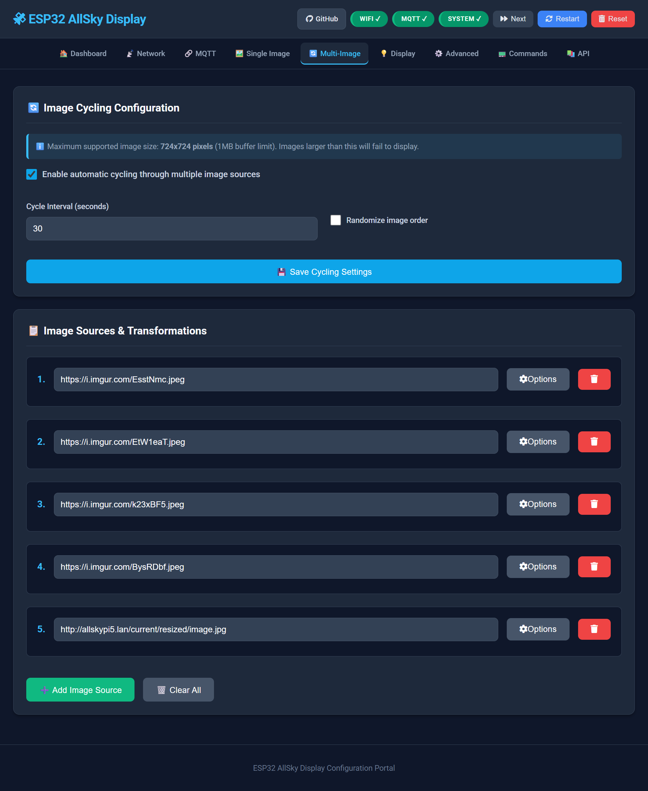
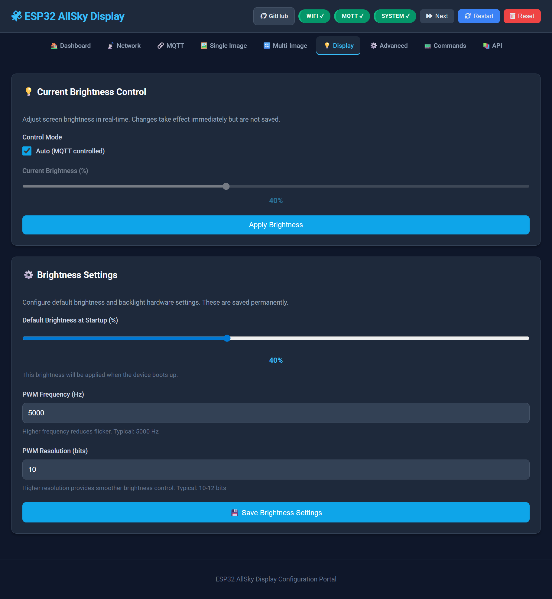

# ESP32-P4 AllSky Display


Transform your ESP32-P4 display into a all-sky camera viewer with multi-image cycling, hardware acceleration, and seamless Home Assistant integration.


### 🎥 Watch Demo Video

[](https://www.youtube.com/watch?v=pPAgbkPNvvY)

[▶️ Click here to watch on YouTube](https://www.youtube.com/watch?v=pPAgbkPNvvY)

## 📋 Quick Links

- [Quick Start](#-quick-start) - Get up and running in minutes
- [Features](#-features) - What this project can do
- [Hardware](#-hardware-requirements) - Supported displays
- [Configuration](#-configuration) - Web UI, MQTT, and touch controls
- [OTA Updates](OTA_GUIDE.md) - Wireless firmware updates
- [Troubleshooting](#-troubleshooting) - Common issues and solutions

[](https://github.com/chvvkumar/ESP32-P4-Allsky-Display/actions/workflows/arduino-compile.yml)
[](https://github.com/chvvkumar/ESP32-P4-Allsky-Display/releases/latest)


[](https://deepwiki.com/chvvkumar/ESP32-P4-Allsky-Display)

## ✨ Features

### Core Functionality
- **Multi-Image Display** - Cycle through up to 10 image sources automatically
- **Hardware Accelerated** - ESP32-P4 PPA for fast scaling and rotation
- **Per-Image Transforms** - Individual scale, offset, and rotation settings
- **Touch Controls** - Tap to navigate, double-tap to toggle modes
- **Easy Setup** - Captive portal WiFi configuration with QR code

### Integration & Updates
- **Home Assistant Ready** - Auto-discovery via MQTT with full control
- **Web Configuration** - Modern, responsive UI for all settings
- **OTA Updates** - Wireless firmware updates with automatic rollback
- **Serial Commands** - Direct control via USB for debugging

## 🛠️ Hardware Requirements

**Supported Displays:**
- [Waveshare 3.4" ESP32-P4 Touch LCD](https://www.waveshare.com/esp32-p4-wifi6-touch-lcd-3.4c.htm) (800×800) ✅ **Tested & Confirmed Working**
- [Waveshare 4.0" ESP32-P4 Touch LCD](https://www.waveshare.com/wiki/ESP32-P4-WIFI6-Touch-LCD-4C) (720×720) ⚠️ **Untested - Configuration Available**

**Requirements:** ESP32-P4 with WiFi 6, DSI display, GT911 touch, 16MB flash, **PSRAM required**

**Note:** This project has been developed and tested exclusively on the 3.4" display. The 4.0" display configuration is available in the code but has not been verified on actual hardware.

**Optional 3D Printed Case:** [Download from Printables](https://www.printables.com/model/1352883-desk-stand-for-waveshare-esp32-p4-wifi6-touch-lcd)


## 🚀 Quick Start

### 1. Flash Pre-Compiled Firmware

**⚠️ Display Compatibility Notice:**
- Pre-compiled `.bin` files are configured for the **3.4" display (800×800)** only
- **4.0" display (720×720) users:** Must compile from source (see [MANUAL_SETUP.md](MANUAL_SETUP.md))
- Display configuration is set at compile time in `displays_config.h`

**Download Latest Release:**
- Go to [Releases](https://github.com/chvvkumar/ESP32-P4-Allsky-Display/releases/latest)
- Download `ESP32-P4-Allsky-Display.bin` (for 3.4" display only)

**Flash Using esptool:**
```powershell
esptool.py --chip esp32p4 --port COM3 --baud 921600 write_flash 0x0 ESP32-P4-Allsky-Display.bin
```

**Or use ESP Flash Download Tool:**
1. Download [Flash Download Tools](https://www.espressif.com/en/support/download/other-tools)
2. Select ESP32-P4, load .bin file at address 0x0
3. Click Start

**4.0" Display Users:** See [MANUAL_SETUP.md](MANUAL_SETUP.md) for compilation instructions with display selection

### 3. WiFi Setup (First Boot)

The device creates an open WiFi network for easy configuration:

1. **Connect to WiFi:** `AllSky-Display-Setup` (no password)
2. **Scan QR Code** on display or open browser to `http://192.168.4.1`

   

3. **Select Network**, enter password, click Connect
4. **Device restarts** and shows IP address

**Advanced:** For hardcoded WiFi setup, see [MANUAL_SETUP.md](MANUAL_SETUP.md)

### 3. Configure via Web Interface

Access `http://[device-ip]:8080/` to configure:
- Image sources (up to 10 URLs)
- MQTT/Home Assistant settings
- Display transforms and brightness
- Cycle intervals

## ⚙️ Configuration

### Web Interface

Modern, responsive configuration portal at `http://[device-ip]:8080/`


**Features:**
- Dark theme with toast notifications
- Mobile responsive with hamburger menu
- Keyboard shortcuts (Ctrl+S to save, Ctrl+R to restart, Ctrl+N next image)
- Real-time validation and feedback
- Auto-updating status display

**Configuration Pages:**
- **Home** - System status and quick actions
- **Console** - Real-time serial output monitoring over WiFi
- **WiFi** - Network settings
- **MQTT** - Home Assistant integration
- **Images** - Multi-image sources (up to 10)
- **Display** - Brightness and transforms
- **Advanced** - Intervals and thresholds

### Remote Serial Monitoring

**WebSocket Console:** Access `http://[device-ip]:8080/console` to view real-time serial output over WiFi

**Features:**
- No USB connection required
- Real-time log streaming via WebSocket (port 81)
- Auto-scroll, message counter, log filtering
- Download logs to file
- Connect/disconnect on demand

**Use Cases:** Monitor debug output remotely, troubleshoot network issues, verify system behavior

### OTA Updates

Wireless firmware updates without USB cable - see detailed [OTA_GUIDE.md](OTA_GUIDE.md)

**Quick Methods:**

1. **ElegantOTA (Web):** `http://[device-ip]:8080/update` - Drag & drop `.bin` file
2. **ArduinoOTA (IDE):** Select network port → Upload

**Features:** Automatic rollback if update fails, configuration preserved, progress shown on display

### Home Assistant Integration


**Auto-Discovery:** Enable MQTT in web interface, device appears automatically in HA

**Entities:** Light (brightness), Switches (cycling, random), Numbers (transforms), Select (image picker), Buttons (actions), Sensors (WiFi, memory, uptime)

## 📷 AllSky Image Optimization

**⚠️ Important:** Resize images to ≤1MB to prevent crashes. Use 720×720 (4") or 800×800 (3.4") dimensions.

**Quick Setup Script:**

```bash
#!/bin/bash
INPUT_DIR="/home/pi/allsky/tmp"
OUTPUT_DIR="/home/pi/allsky/resized"
RESIZE_DIMENSIONS="720x720"  # or 800x800 for 3.4"

mkdir -p "${OUTPUT_DIR}"
/usr/bin/mogrify -path "${OUTPUT_DIR}" -resize "${RESIZE_DIMENSIONS}" "${INPUT_DIR}/image.jpg"
```

**Setup Options:**

1. **AllSky Module** (Recommended): Add script to AllSky Module Manager → Use `http://your-server/resized/image.jpg`
2. **Cron Job**: Run script every 1-10 minutes with `crontab -e`

## 🎮 Controls

### Touch Gestures
- **Single Tap** - Next image
- **Double Tap** - Toggle cycling/single-refresh mode

### Serial Commands (9600 baud)

```
Scale & Transform:        Navigation:           System:
+/-  : Scale ±0.1         N : Next image        B : Reboot
WASD : Move 10px          R : Refresh           C : Clear config
QE   : Rotate 90°         T : Toggle cycling    F : Factory reset

Display:                  Info:
L/K  : Brightness ±10%    I : Status            H/? : Help
X    : Reset transforms   M : Memory            V : Version
```

### Configuration Screenshots

 

## 🐛 Troubleshooting

| Issue | Solution |
|-------|----------|
| **Won't compile** | Enable PSRAM in Arduino IDE, verify ESP32 core 3.3.4+ |
| **Out of memory** | Resize images to ≤1MB, monitor PSRAM in serial output |
| **WiFi won't connect** | Check credentials, verify 2.4GHz network, check serial output |
| **Touch not working** | Verify GT911 I2C connections, check debug output |
| **Images won't load** | Verify URL accessible, check image size, use resized images |
| **OTA fails** | See [OTA_GUIDE.md](OTA_GUIDE.md) troubleshooting section |

**Debug Tools:** 
- Serial monitor (9600 baud) - Comprehensive debug output for all operations
- WebSocket console at `/console` - Real-time remote monitoring without USB
- Web interface status page - System health and metrics
- Detailed logging for: WiFi connections, MQTT operations, HTTP downloads, image processing, memory allocations

## 🤝 Contributing

Contributions welcome! Fork → Create feature branch → Test → Submit PR

## 📄 License

Open source - see LICENSE file for details

## 💬 Support

- [GitHub Issues](https://github.com/chvvkumar/ESP32-P4-Allsky-Display/issues) for bugs
- [Discussions](https://github.com/chvvkumar/ESP32-P4-Allsky-Display/discussions) for questions
- Check documentation: [OTA_GUIDE.md](OTA_GUIDE.md) | [MANUAL_SETUP.md](MANUAL_SETUP.md)
