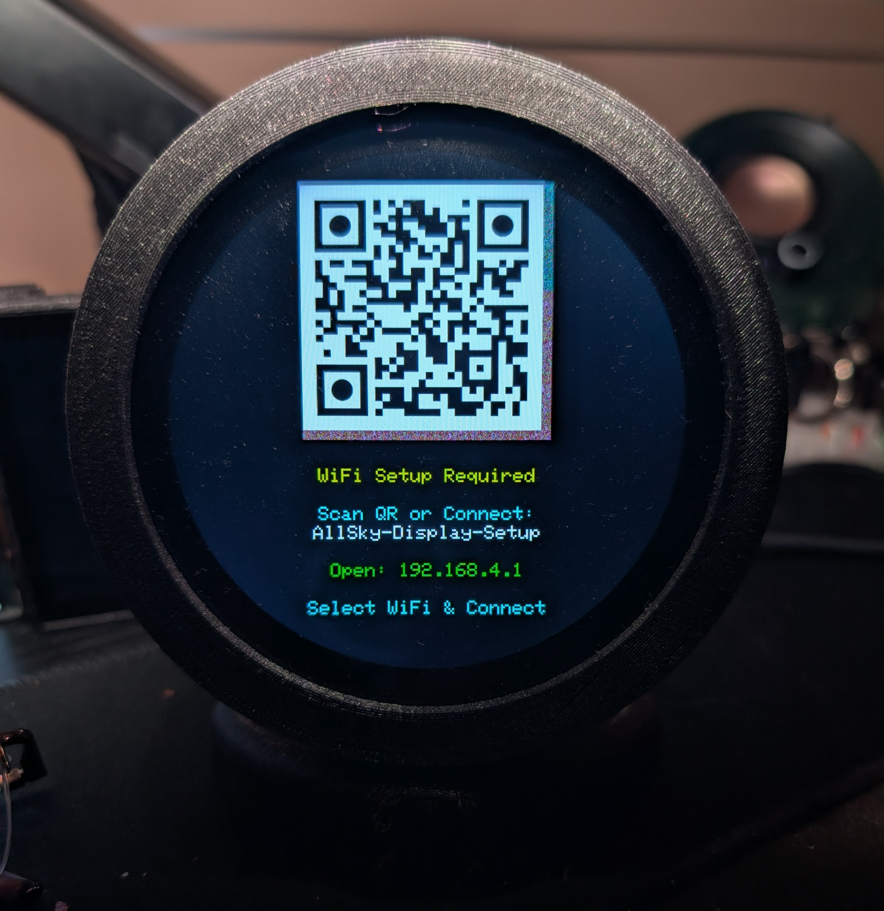
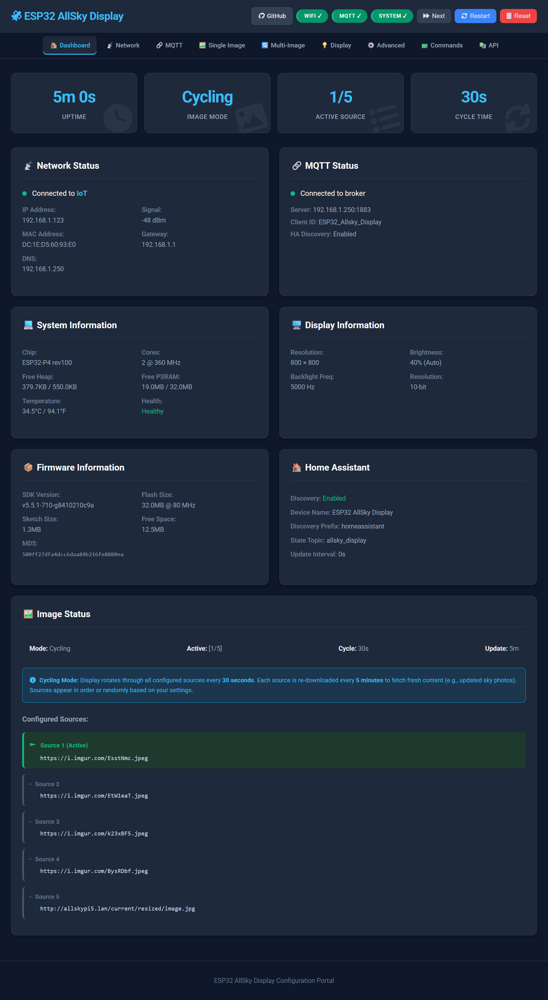

# ESP32-P4 AllSky Display

Transform your ESP32-P4 display into an all-sky camera viewer with multi-image cycling, hardware acceleration, and seamless Home Assistant integration.


---

## 🎥 Demo Video

[](https://www.youtube.com/watch?v=pPAgbkPNvvY)

[▶️ Click here to watch on YouTube](https://www.youtube.com/watch?v=pPAgbkPNvvY)

---

## � Build Status & Badges

[](https://github.com/chvvkumar/ESP32-P4-Allsky-Display/actions/workflows/arduino-compile.yml)
[](https://github.com/chvvkumar/ESP32-P4-Allsky-Display/releases/latest)


[](https://deepwiki.com/chvvkumar/ESP32-P4-Allsky-Display)

---

## �📖 Documentation

Complete user and developer documentation organized by user journey:

### Getting Started
- **[🛠 Hardware Requirements](docs/01_hardware.md)** - Supported displays, ESP32-P4 specs, required libraries
- **[⚡ Installation Guide](docs/02_installation.md)** - Flash firmware, compile from source, first boot WiFi setup
- **[⚙️ Configuration Guide](docs/03_configuration.md)** - Web UI, MQTT, multi-image setup, serial commands

### Using Your Display
- **[✨ Features & Usage](docs/04_features.md)** - Multi-image cycling, touch controls, health monitoring, Home Assistant
- **[📡 OTA Updates](docs/05_ota_updates.md)** - Wireless firmware updates with automatic rollback
- **[🐛 Troubleshooting](docs/06_troubleshooting.md)** - Common issues, crash diagnosis, getting help

### Developer Documentation
- **[💻 System Architecture](docs/developer/architecture.md)** - Design overview, memory layout, control flow diagrams
- **[📚 API Reference](docs/developer/api_reference.md)** - Class documentation, REST API endpoints

---

## ✨ Key Features

- **Multi-Image Display** - Cycle through up to 10 image sources automatically or via API triggers
- **Flexible Update Modes** - Automatic cycling or API-triggered refresh for external control (v-snd-0.62+)
- **Runtime Display Selection** - Switch between 3.4" and 4.0" displays via Web UI without recompilation (v-snd-0.61+)
- **Enhanced Brightness Control** - Three modes: Manual, MQTT Auto, or Home Assistant with clear UI indication (v-snd-0.61+)
- **Hardware Accelerated** - ESP32-P4 PPA for fast scaling and rotation (385-507ms render time)
- **High Resolution** - Up to 1448×1448 pixel images with 2× scaling capability
- **Per-Image Transforms** - Individual scale, offset, and rotation settings for each image
- **Touch Controls** - Tap to navigate, double-tap to toggle modes
- **Home Assistant Ready** - Auto-discovery via MQTT with full control
- **Web Configuration** - Modern, responsive UI for all settings
- **OTA Updates** - Wireless firmware updates with automatic rollback
- **Easy Setup** - Captive portal WiFi configuration with QR code

---

## 🚀 Quick Start

### 1. Hardware Required

- [Waveshare 3.4" ESP32-P4 Touch LCD](https://www.waveshare.com/esp32-p4-wifi6-touch-lcd-3.4c.htm) (800×800) ✅ **Tested & Working**
- [Waveshare 4.0" ESP32-P4 Touch LCD](https://www.waveshare.com/wiki/ESP32-P4-WIFI6-Touch-LCD-4C) (720×720) ⚠️ **Untested**

**Requirements:** ESP32-P4 with WiFi 6, DSI display, GT911 touch, PSRAM required

📖 **Full Details:** [Hardware Requirements Guide](docs/01_hardware.md)

### 2. Flash Firmware

**Download Latest Release:**
- Go to [Releases](https://github.com/chvvkumar/ESP32-P4-Allsky-Display/releases/latest)
- Download `ESP32-P4-Allsky-Display.bin`

**Flash using esptool:**
```powershell
esptool.py --chip esp32p4 --port COM3 --baud 921600 write_flash 0x0 ESP32-P4-Allsky-Display.bin
```

⚠️ **Pre-compiled binaries are for 3.4" display only.** 

💡 **NEW (v-snd-0.61+):** Display type can now be changed via Web UI without recompilation! Flash the 3.4" binary, then select 4.0" display in System settings if needed.

📖 **Full Instructions:** [Installation Guide](docs/02_installation.md)

### 3. WiFi Setup

On first boot, the device creates a WiFi network:

1. **Connect to:** `AllSky-Display-Setup` (no password)
2. **Scan QR Code** on display or open `http://192.168.4.1`
3. **Select network**, enter password, click Connect
4. **Device reboots** and shows IP address



📖 **Full Details:** [Installation Guide - First Boot](docs/02_installation.md#first-boot--wifi-setup)

### 4. Configure via Web Interface

Access `http://[device-ip]:8080/` to configure:
- Image sources (up to 10 URLs)
- MQTT/Home Assistant settings
- Display transforms and brightness
- Cycle intervals



📖 **Full Guide:** [Configuration Guide](docs/03_configuration.md)

---

## 🏠 Home Assistant Integration


**Auto-Discovery:** Enable MQTT in web interface, device appears automatically

**Control:** Brightness, cycling, image selection, transforms, system actions

📖 **Full Integration Guide:** [Features - Home Assistant](docs/04_features.md#home-assistant-integration)

---

## 📷 Optional 3D Printed Case


**Download:** [Printables.com - Desk Stand](https://www.printables.com/model/1352883-desk-stand-for-waveshare-esp32-p4-wifi6-touch-lcd)

---

## 🤝 Support & Contributing

- **[GitHub Issues](https://github.com/chvvkumar/ESP32-P4-Allsky-Display/issues)** - Report bugs or request features
- **[Discussions](https://github.com/chvvkumar/ESP32-P4-Allsky-Display/discussions)** - Ask questions, share configurations
- **[Troubleshooting Guide](docs/06_troubleshooting.md)** - Common issues and solutions

**Contributions Welcome!** Fork → Create feature branch → Test → Submit PR

---

## 📄 License

Open source - see LICENSE file for details

---

## 🗺️ Complete Documentation Map

### User Documentation
1. [Hardware Requirements](docs/01_hardware.md) - Displays, ESP32-P4, libraries, wiring
2. [Installation Guide](docs/02_installation.md) - Flash firmware, compile from source, WiFi setup
3. [Configuration Guide](docs/03_configuration.md) - Web UI, MQTT, images, serial commands
4. [Features & Usage](docs/04_features.md) - Controls, health monitoring, Home Assistant
5. [OTA Updates](docs/05_ota_updates.md) - Wireless updates, A/B partitions, safety
6. [Troubleshooting](docs/06_troubleshooting.md) - Common issues, crash diagnosis, diagnostics

### Developer Documentation
- [System Architecture](docs/developer/architecture.md) - Design, memory layout, data flow
- [API Reference](docs/developer/api_reference.md) - Classes, REST endpoints, MQTT topics

---

**Made with ❤️ for the AllSky community**
