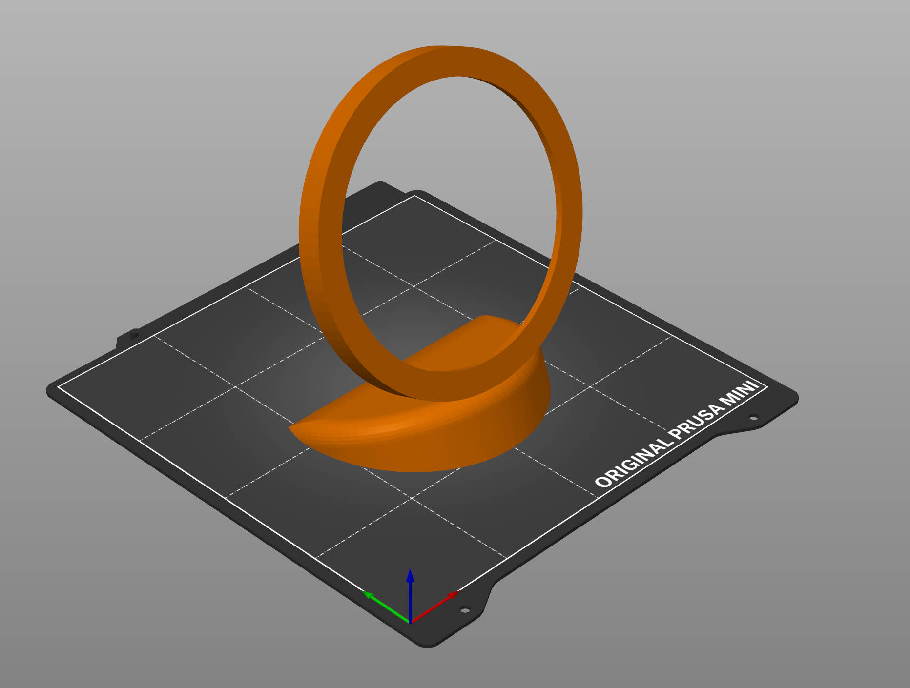
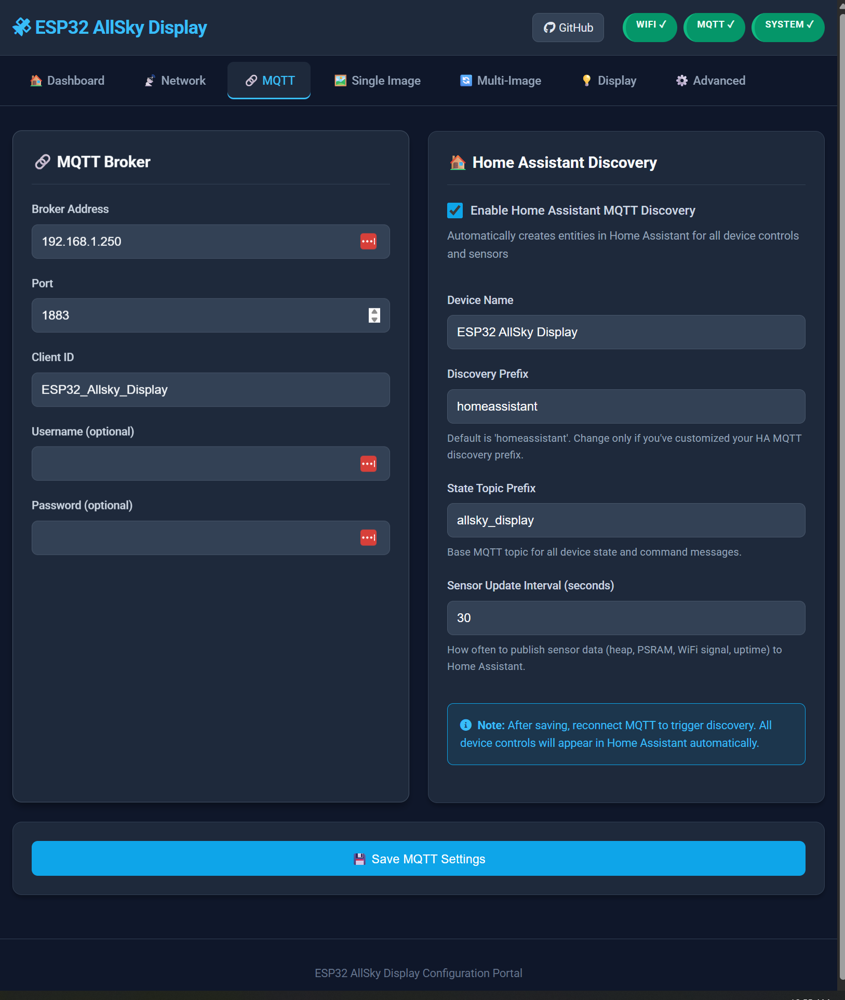
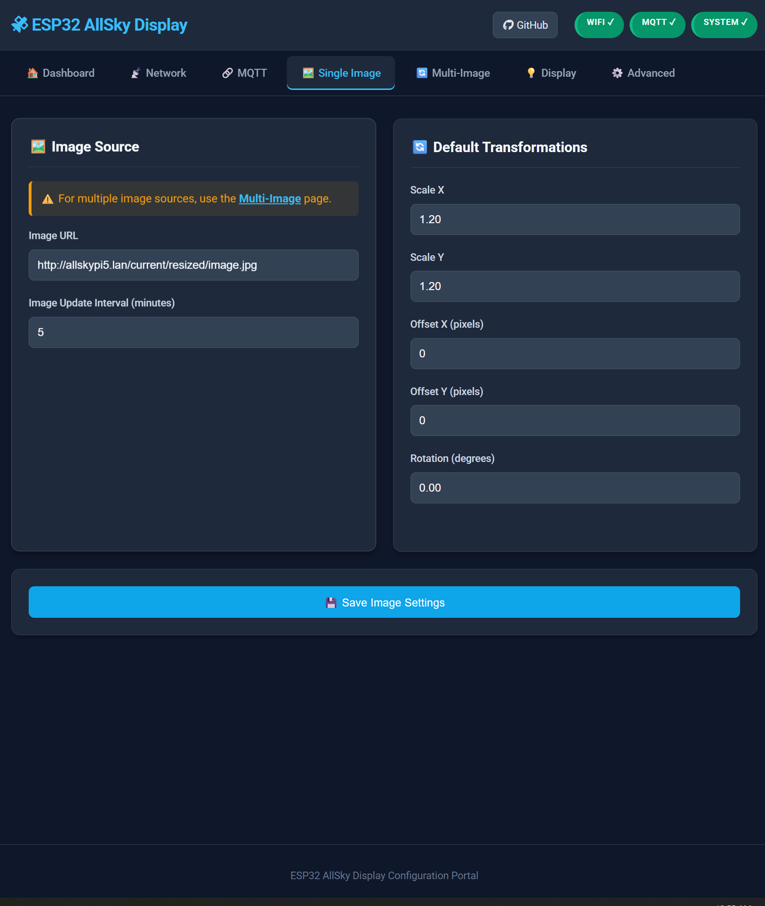
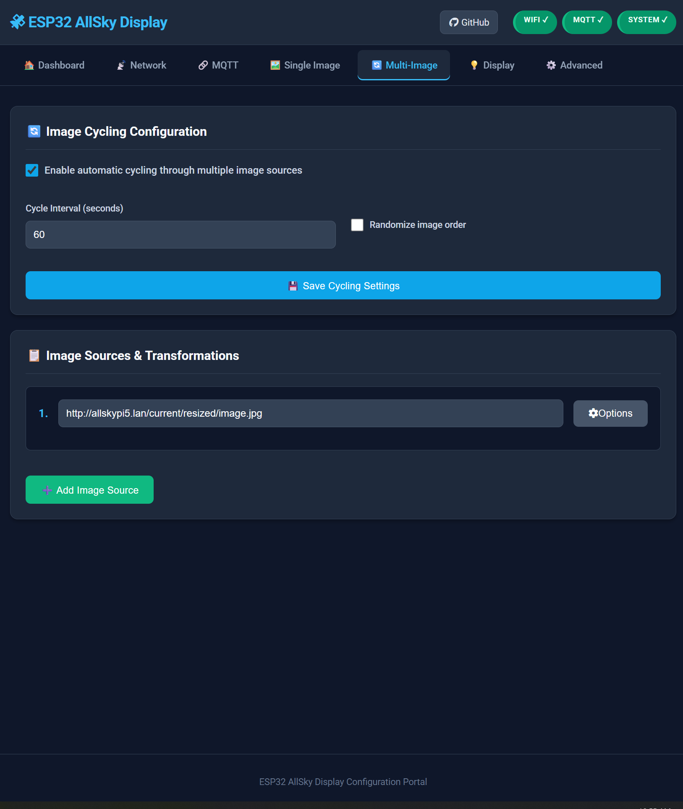
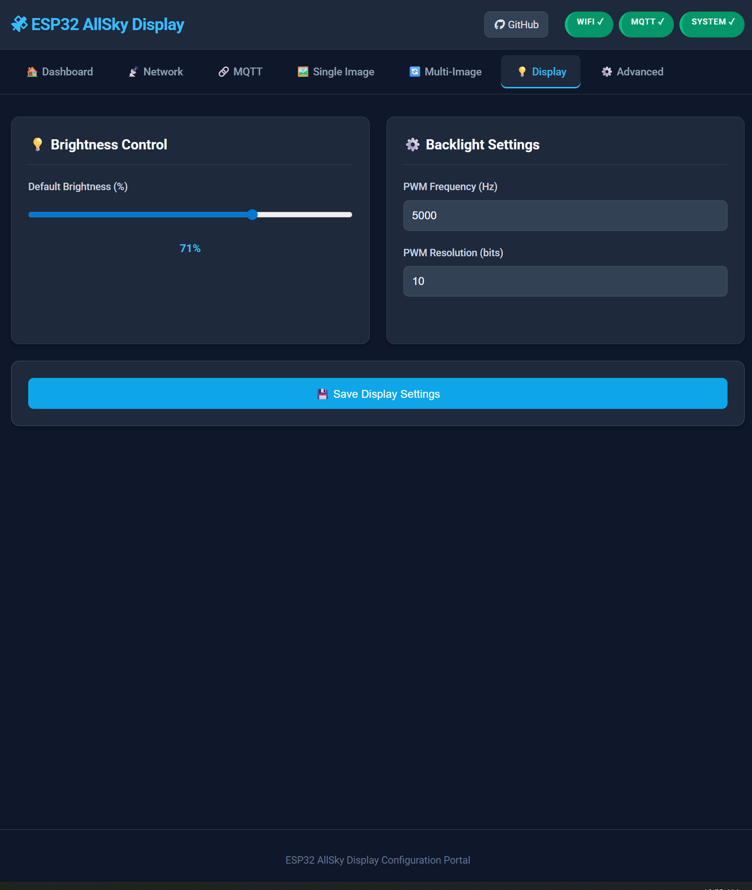

# ESP32-P4 AllSky Display

An image display for [AllSky](https://github.com/AllskyTeam/allsky) cameras using ESP32-P4 with multi-image cycling, hardware acceleration, web configuration, and Home Assistant integration.


## 🎥 Demo

Check out the video below to see the display in action:

[](https://www.youtube.com/watch?v=pPAgbkPNvvY)

## 📋 Table of Contents

- [Build Status](#build-status)
- [Overview](#overview)
- [Features](#features)
- [Hardware Requirements](#hardware-requirements)
- [Installation](#installation)
- [Configuration](#configuration)
- [Usage](#usage)
- [Home Assistant Integration](#home-assistant-integration)
- [Troubleshooting](#troubleshooting)
- [Contributing](#contributing)

## 🚀 Build Status

[](https://github.com/chvvkumar/ESP32-P4-Allsky-Display/actions/workflows/arduino-compile.yml)
[](https://github.com/chvvkumar/ESP32-P4-Allsky-Display/actions/workflows/release.yml)
[](https://github.com/chvvkumar/ESP32-P4-Allsky-Display/releases/latest)

## 🌟 Overview

This project makes your ESP32-P4 touch display into an all-sky camera viewer with features like image cycling, per-image transformations, MQTT control, and seamless Home Assistant integration.

**Key Highlights:**
- Display images from multiple sources with automatic cycling
- Real-time image transformations (scale, offset, rotation)
- Complete web-based configuration interface
- Native Home Assistant integration via MQTT discovery
- Touch controls for quick navigation
- Hardware-accelerated image processing using ESP32-P4 PPA

## ✨ Features

- **Multi-source image cycling**: Display images from up to 10 different URLs with automatic cycling
- **Hardware-accelerated processing**: Fast image scaling and rotation using ESP32-P4 PPA
- **Per-image transformations**: Individual scale, offset, and rotation settings for each image
- **Web-based configuration**: Complete setup interface accessible via browser
- **Home Assistant integration**: Native MQTT discovery with full control and monitoring
- **Touch controls**: Single tap for next image, double tap to toggle modes

### Interactive Controls
- **Touch interface**: 
  - Single tap: Next image
  - Double tap: Toggle cycling/refresh modes
- **Serial commands**: Real-time manipulation via USB
- **Transform controls**: Scale (+/-), Move (WASD), Rotate (QE)

## 🛠️ Hardware Requirements

**Supported Displays:**
- [Waveshare ESP32-P4-WIFI6-Touch-LCD-3.4C](https://www.waveshare.com/esp32-p4-wifi6-touch-lcd-3.4c.htm) (800x800)
- [Waveshare ESP32-P4-WIFI6-Touch-LCD-4C](https://www.waveshare.com/wiki/ESP32-P4-WIFI6-Touch-LCD-4C) (720x720)

**Specifications:**
- ESP32-P4 MCU with WiFi 6
- DSI touch display
- GT911 capacitive touch controller
- 16MB flash, PSRAM support required

**Optional 3D Printed Case:**



[Download from Printables](https://www.printables.com/model/1352883-desk-stand-for-waveshare-esp32-p4-wifi6-touch-lcd)

## 📦 Installation

### Prerequisites

1. **Arduino IDE** (1.8.19 or later) or **PlatformIO**
2. **ESP32 Arduino Core** (3.3.4+)
3. **Required Libraries**:
   - GFX Library for Arduino (1.6.3+)
   - JPEGDEC (1.8.4+)
   - PubSubClient (2.8.0+)

### Arduino IDE Setup


### Initial Setup

#### 1. Configure WiFi Credentials

**⚠️ IMPORTANT**: Edit WiFi settings **before** first upload.

Open [`config_storage.cpp`](config_storage.cpp) and modify:

````cpp
void ConfigStorage::setDefaults() {
    // *** EDIT THESE LINES ***
    config.wifiSSID = "YOUR_WIFI_SSID";        // Your network name
    config.wifiPassword = "YOUR_WIFI_PASSWORD"; // Your password
    
    // MQTT settings (optional, can configure via web later)
    config.mqttServer = "192.168.1.250";       // MQTT broker IP
    config.mqttPort = 1883;
    config.mqttUser = "";                       // Optional
    config.mqttPassword = "";                   // Optional
}
````

#### 2. Configure Default Image Source (Optional)

In [`config.cpp`](config.cpp), set your default image URLs:

```cpp
const char* DEFAULT_IMAGE_SOURCES[] = {
    "http://your-server.com/image1.jpg",
    "http://your-server.com/image2.jpg",
    // Add more as needed
};
```

#### 3. Compile and Upload

- Click the Upload button in Arduino IDE
- Monitor serial output for IP address and status

#### 4. Access Web Interface

- Open a browser and go to `http://[device-ip]:8080/`
- Configure additional settings like MQTT and image sources

## ⚙️ Configuration

### Web Interface
- Access: `http://[device-ip]:8080/`
- Configure image sources, display settings, network, and MQTT

### Home Assistant MQTT Discovery
The device automatically integrates with Home Assistant when MQTT discovery is enabled:

**Entities Created:**
- **Light**: Brightness control (0-100%)
- **Switches**: Cycling enabled, Random order, Auto brightness
- **Numbers**: Cycle interval, Update interval, Per-image transforms (scale, offset, rotation)
- **Select**: Current image source selector
- **Buttons**: Reboot device, Next image, Reset transforms
- **Sensors**: Current image URL, Free heap, Free PSRAM, WiFi signal, Uptime, Image count

**Setup:**
1. Configure MQTT broker settings in web interface
2. Enable "Home Assistant Discovery" in MQTT settings
3. Set device name and topic preferences (optional)
4. Save and reconnect MQTT
5. Device appears automatically in Home Assistant

All device controls and sensors will be available in Home Assistant for dashboards, automations, and scripts.

## 📷 Image Optimization for AllSky

**⚠️ IMPORTANT**: The ESP32-P4 has limited resources. Large images (over 1MB or high resolution) can cause crashes or out-of-memory errors. It's highly recommended to resize images before serving them to the device.

### Automated Image Resizing Script

Use this script to automatically resize AllSky images to an optimal size for the display:

```bash
#!/bin/bash

# Configuration variables
INPUT_DIR="/home/pi/allsky/tmp"
OUTPUT_DIR="/home/pi/allsky/resized"
IMAGE_NAME="image.jpg"
RESIZE_DIMENSIONS="720x720"

# Create output directory if it doesn't exist
mkdir -p "${OUTPUT_DIR}"

# Resize allsky image on demand
/usr/bin/mogrify -path "${OUTPUT_DIR}" -resize "${RESIZE_DIMENSIONS}" "${INPUT_DIR}/${IMAGE_NAME}" >/dev/null 2>&1
```

### Setup Options

#### Option 1: AllSky Script Module (Recommended)

1. Save the script as `/home/pi/allsky/scripts/resize_for_display.sh`
2. Make it executable: `chmod +x /home/pi/allsky/scripts/resize_for_display.sh`
3. In AllSky Web UI, go to **Module Manager → Daytime or Night time capture → Add the 'Allsky script' module to the selected modules → add script path to the module config**
4. Point your display to `http://your-allsky-server/resized/image.jpg`

#### Option 2: Cron Job

1. Save the script to `/home/pi/resize_allsky.sh`
2. Make it executable: `chmod +x /home/pi/resize_allsky.sh`
3. Edit crontab: `crontab -e`
4. Add one of these lines based on your preference:

```bash
# Run every minute
* * * * * /home/pi/resize_allsky.sh

# Run every 5 minutes
*/5 * * * * /home/pi/resize_allsky.sh

# Run every 10 minutes
*/10 * * * * /home/pi/resize_allsky.sh
```

5. Save and exit
6. Point your display to `http://your-allsky-server/current/resized/image.jpg`

**Note**: Adjust `RESIZE_DIMENSIONS` based on your display model (720x720 for 4C, 800x800 for 3.4C).

## 🖥️ Web Configuration Interface

The device provides a comprehensive web-based configuration interface accessible at `http://[device-ip]:8080/`. All settings can be configured through an intuitive UI without needing to recompile the firmware.

### Configuration Pages











### Home Assistant Integration


### Touch Controls
```
Single Tap  : Next image (cycling mode)
Double Tap  : Toggle cycling/refresh modes
```

### Serial Commands
```
+/-   : Scale image        R     : Reset transforms
W/S   : Move up/down       L/K   : Brightness
A/D   : Move left/right    B     : Reboot
Q/E   : Rotate CCW/CW      M/I/P : System info
```

## 🐛 Troubleshooting

### Common Issues
1. **Compilation**: Enable PSRAM, check ESP32 core version
2. **Memory**: Monitor PSRAM usage in serial output
3. **Network**: Verify WiFi credentials and image URL access
4. **Touch**: Check GT911 I2C connections and debug output

### Debug Information
- Serial output for comprehensive debugging
- Web interface for real-time system status
- Memory and network monitoring

## Contributing

1. Fork the repository
2. Create a feature branch
3. Test thoroughly
4. Submit a pull request

## License

Open source project. Check license file for details.

## Support

- Create GitHub issues for bugs/features
- Check troubleshooting section
- Monitor serial output for debugging

