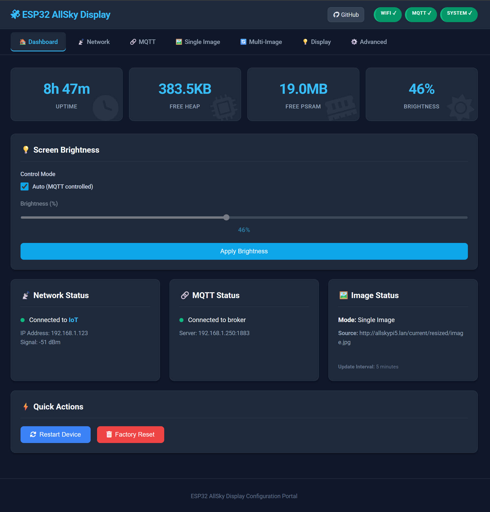
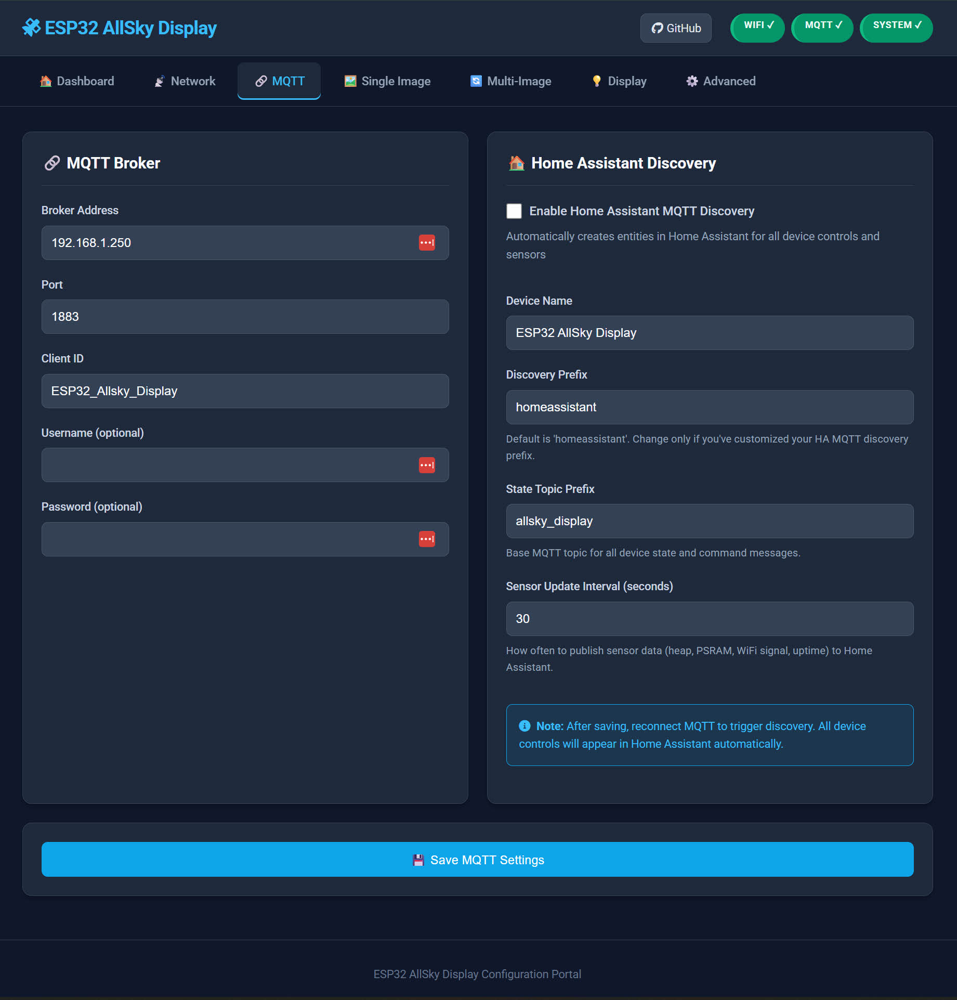
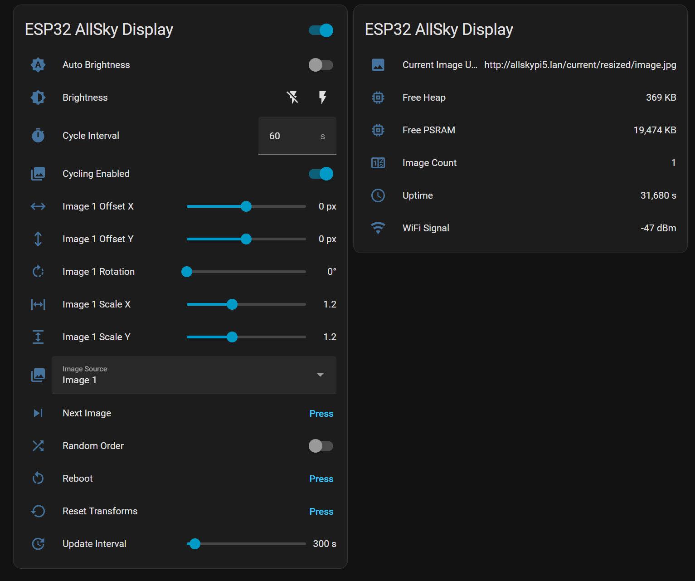

# ESP32-P4-WIFI6-Touch-LCD-3.4C / ESP32-P4-WIFI6-Touch-LCD-4C AllSky Display

An image display system for ESP32-P4 with multi-image cycling, hardware acceleration, web configuration, and MQTT control.

## Documentation

🔗 [Product Page](https://www.waveshare.com/esp32-p4-wifi6-touch-lcd-3.4c.htm)

📝 [Product documentation](https://www.waveshare.com/wiki/ESP32-P4-WIFI6-Touch-LCD-3.4C)

## Features

### Image Display & Processing
- **Multi-Image Cycling**: Cycle through up to 10 image sources
- **Hardware Acceleration**: PPA for fast scaling and rotation
- **Real-time Transformations**: Scale, rotate, and position images
- **JPEG Support**: Efficient decoding with format validation
- **Memory Management**: PSRAM-optimized buffering

### Web Configuration Interface
- **Modern UI**: Clean, responsive web interface
- **Real-time Status**: Live system monitoring
- **Image Source Management**: Add/remove/configure sources
- **Display Settings**: Brightness and update intervals

### Home Assistant Integration
- **MQTT Discovery**: Automatic entity creation in Home Assistant
- **Full Device Control**: All settings controllable from HA
- **Per-Image Transforms**: Control scale, offset, rotation for each image
- **Live Sensors**: Heap, PSRAM, WiFi signal, uptime monitoring
- **Buttons & Switches**: Reboot, next image, cycling controls

### Interactive Controls
- **Touch Interface**: Single tap (next image), double tap (toggle mode)
- **Serial Commands**: Real-time manipulation via serial
- **Transform Controls**: Scale (+/-), Move (WASD), Rotate (QE)

### System Features
- **Simple WiFi setup**: With hotspot
- **MQTT Integration**: Home Assistant auto-discovery
- **Watchdog Protection**: Prevents system freezes
- **Memory Monitoring**: Real-time usage tracking
- **Error Recovery**: Automatic reconnection and retry

## Demo


**Watch the ESP32-P4 AllSky Display in action:**

[](https://www.youtube.com/watch?v=pPAgbkPNvvY)

[View on YouTube](https://www.youtube.com/watch?v=pPAgbkPNvvY)

## 3D Printed Case

[Printables link for 3D printed case](https://www.printables.com/model/1352883-desk-stand-for-waveshare-esp32-p4-wifi6-touch-lcd)

## Screenshots

### Web Interface

Home Page


MQTT Settings


Home Assistant MQTT Device


## Hardware Requirements

- ESP32-P4 microcontroller with PSRAM
- DSI Display with GT911 touch controller
- WiFi connection for image downloading

## Installation

1. **Arduino IDE Setup**:
   - Install ESP32 core (3.2.1+)
   - Enable PSRAM in Tools menu
   - Install required libraries

2. **Configuration**:
   - Access web interface at device IP
   - Configure image sources and settings

## Dependencies

- ESP32 Core (3.2.1+)
- GFX Library for Arduino (1.6.0)
- JPEGDEC (1.8.2+)
- PubSubClient (2.8+)

## Configuration

### Web Interface
- Access: `http://[device-ip]:8080/`
- Configure image sources, display settings, network, and MQTT

### Home Assistant MQTT Discovery
The device automatically integrates with Home Assistant when MQTT discovery is enabled:

**Entities Created:**
- **Light**: Brightness control (0-100%)
- **Switches**: Cycling enabled, Random order, Auto brightness
- **Numbers**: Cycle interval, Update interval, Per-image transforms (scale, offset, rotation)
- **Select**: Current image source selector
- **Buttons**: Reboot device, Next image, Reset transforms
- **Sensors**: Current image URL, Free heap, Free PSRAM, WiFi signal, Uptime, Image count

**Setup:**
1. Configure MQTT broker settings in web interface
2. Enable "Home Assistant Discovery" in MQTT settings
3. Set device name and topic preferences (optional)
4. Save and reconnect MQTT
5. Device appears automatically in Home Assistant

All device controls and sensors will be available in Home Assistant for dashboards, automations, and scripts.

### Touch Controls
```
Single Tap  : Next image (cycling mode)
Double Tap  : Toggle cycling/refresh modes
```

### Serial Commands
```
+/-   : Scale image        R     : Reset transforms
W/S   : Move up/down       L/K   : Brightness
A/D   : Move left/right    B     : Reboot
Q/E   : Rotate CCW/CW      M/I/P : System info
```

## Troubleshooting

### Common Issues
1. **Compilation**: Enable PSRAM, check ESP32 core version
2. **Memory**: Monitor PSRAM usage in serial output
3. **Network**: Verify WiFi credentials and image URL access
4. **Touch**: Check GT911 I2C connections and debug output

### Debug Information
- Serial output for comprehensive debugging
- Web interface for real-time system status
- Memory and network monitoring

## Contributing

1. Fork the repository
2. Create a feature branch
3. Test thoroughly
4. Submit a pull request

## License

Open source project. Check license file for details.

## Support

- Create GitHub issues for bugs/features
- Check troubleshooting section
- Monitor serial output for debugging
