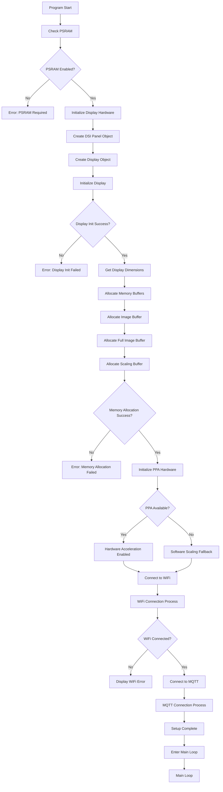
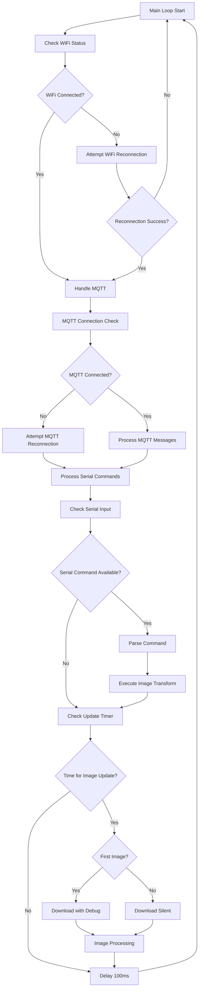
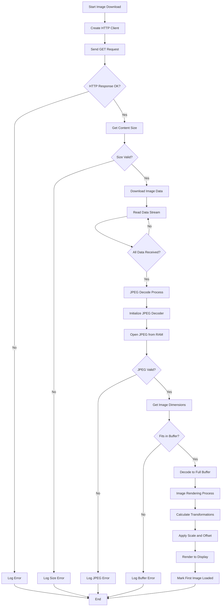
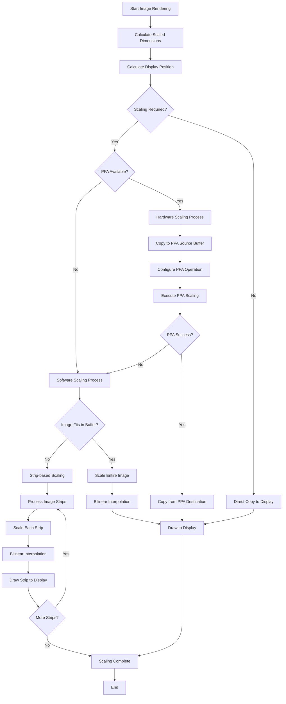
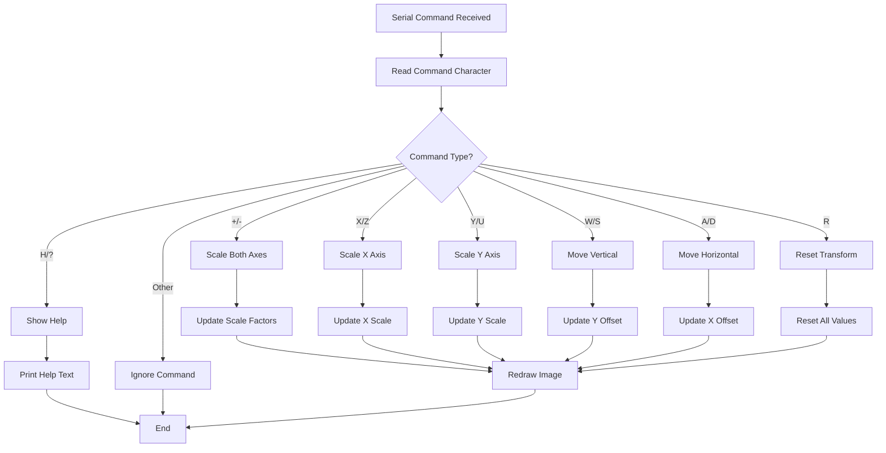
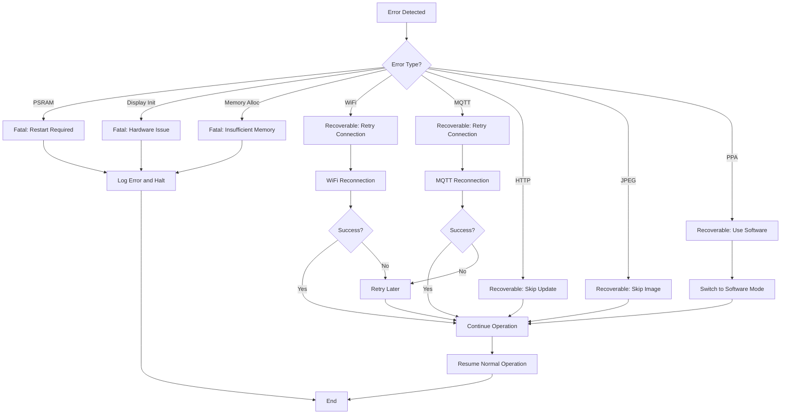

# ESP32-P4 Allsky Display

A sophisticated image display system for ESP32-P4 microcontrollers featuring DSI display support, MQTT connectivity, hardware-accelerated image scaling, and touch interface capabilities.

## Project Overview

This project creates an all-sky camera display system that downloads and displays images from a web server on a high-resolution DSI display. It features real-time image transformation controls, MQTT-based remote reboot capability, and hardware-accelerated image processing using the ESP32-P4's PPA (Pixel Processing Accelerator).

## Features

- **High-Resolution DSI Display Support**: Compatible with 3.4" (800x800) and 4" (720x720) DSI displays
- **Hardware-Accelerated Image Processing**: Utilizes ESP32-P4's PPA for fast image scaling
- **Over-The-Air (OTA) Updates**: Web-based firmware updates using ElegantOTA
- **MQTT Integration**: Remote device reboot via MQTT
- **Real-Time Image Transformation**: Scale, move, and transform images via serial commands
- **Touch Interface Support**: GT911 touch controller integration
- **WiFi Connectivity**: Automatic image downloading from web servers
- **JPEG Decoding**: Built-in JPEG decoder with bilinear interpolation scaling
- **Memory Optimization**: PSRAM utilization for large image buffers

## Hardware Requirements

This project is designed for the **Waveshare ESP32-P4-WiFi6-Touch-LCD-3.4C** development board.

For complete hardware specifications, pin connections, and library compatibility information, please refer to the official Waveshare documentation:

**📖 [Waveshare ESP32-P4-WiFi6-Touch-LCD-3.4C Documentation](https://www.waveshare.com/esp32-p4-wifi6-touch-lcd-3.4c.htm?sku=31523)**

## Software Dependencies

### Arduino IDE Libraries
Install the following libraries through the Arduino IDE Library Manager:

1. **Arduino_GFX_Library** (latest version)
   - Graphics library for ESP32 displays
   - Provides DSI display support

2. **WiFi** (built-in with ESP32 core)
   - WiFi connectivity functions

3. **HTTPClient** (built-in with ESP32 core)
   - HTTP client for downloading images

4. **JPEGDEC** (latest version)
   - JPEG decoder library
   - Install via Library Manager

5. **PubSubClient** (latest version)
   - MQTT client library
   - Install via Library Manager

### ESP32 Arduino Core
- **Version**: ESP32 Arduino Core 3.0.0 or later
- **Board**: ESP32-P4 support required

## Installation and Setup

### Step 1: Install Arduino IDE
1. Download and install Arduino IDE 2.0 or later from [arduino.cc](https://www.arduino.cc/en/software)

### Step 2: Install ESP32 Board Package
1. Open Arduino IDE
2. Go to **File** → **Preferences**
3. Add this URL to "Additional Board Manager URLs":
   ```
   https://espressif.github.io/arduino-esp32/package_esp32_index.json
   ```
4. Go to **Tools** → **Board** → **Boards Manager**
5. Search for "ESP32" and install "esp32 by Espressif Systems" (version 3.0.0 or later)

### Step 3: Install Required Libraries
1. Go to **Tools** → **Manage Libraries**
2. Install each of the following libraries:
   - Search "Arduino_GFX" → Install "GFX Library for Arduino"
   - Search "JPEGDEC" → Install "JPEGDEC"
   - Search "PubSubClient" → Install "PubSubClient"

### Step 4: Configure Board Settings
1. Go to **Tools** → **Board** → **ESP32 Arduino** → **ESP32P4**
2. Configure the following settings:
   - **Board**: "ESP32P4"
   - **PSRAM**: "OPI PSRAM" (REQUIRED)
   - **Flash Size**: "16MB" (or your board's flash size)
   - **Partition Scheme**: "16M Flash (3MB APP/9.9MB FATFS)"
   - **Upload Speed**: "921600"
   - **Arduino Runs On**: "Core 1"
   - **Events Run On**: "Core 1"

### Step 5: Select Display Type
1. Open `displays_config.h`
2. Set the display type by modifying the `CURRENT_SCREEN` definition:
   ```cpp
   #define CURRENT_SCREEN SCREEN_3INCH_4_DSI  // For 3.4" display
   // OR
   #define CURRENT_SCREEN SCREEN_4INCH_DSI     // For 4" display
   ```

### Step 6: Configure Network Settings
1. Open `ESP32-P4-Allsky-Display.ino`
2. Update WiFi credentials:
   ```cpp
   const char* ssid = "Your_WiFi_SSID";
   const char* password = "Your_WiFi_Password";
   ```
3. Update MQTT settings (optional):
   ```cpp
   const char* mqtt_server = "192.168.1.250";  // Your MQTT broker IP
   const int mqtt_port = 1883;
   const char* mqtt_user = "";                 // MQTT username (if required)
   const char* mqtt_password = "";             // MQTT password (if required)
   ```
4. Update image URL:
   ```cpp
   const char* imageURL = "https://your-server.com/path/to/image.jpg";
   ```

### Step 7: Compile and Upload
1. Connect your ESP32-P4 board via USB
2. Select the correct COM port in **Tools** → **Port**
3. Click **Upload** (Ctrl+U)

## Configuration Options

### Display Configuration
The display configuration is handled in `displays_config.h`:

- **3.4" Display**: 800x800 resolution, optimized timing parameters
- **4" Display**: 720x720 resolution, optimized timing parameters

### Image Settings
```cpp
const unsigned long updateInterval = 60000; // Image update interval (milliseconds)
```

### Transformation Controls
```cpp
const float SCALE_STEP = 0.1;    // Scale increment/decrement
const int16_t MOVE_STEP = 10;    // Movement step in pixels
const float MIN_SCALE = 0.1;     // Minimum scale factor
const float MAX_SCALE = 3.0;     // Maximum scale factor
```

## Usage

### Serial Commands
Control image transformations via Serial Monitor (115200 baud):

#### Scaling Commands
- `+` / `-`: Scale both axes up/down
- `X` / `Z`: Scale X-axis up/down
- `Y` / `U`: Scale Y-axis up/down

#### Movement Commands
- `W` / `S`: Move image up/down
- `A` / `D`: Move image left/right

#### Reset and Help
- `R`: Reset all transformations
- `H` / `?`: Show help menu

### MQTT Control
Send a "reboot" message to restart the device:
```
Topic: Astro/AllSky/display/reboot
Message: reboot
```

Example MQTT command:
```bash
mosquitto_pub -h your-mqtt-broker -t "Astro/AllSky/display/reboot" -m "reboot"
```

### Over-The-Air (OTA) Updates
The device supports wireless firmware updates through a web interface powered by ElegantOTA.

#### Accessing the OTA Interface
1. **Find the device IP address**: Check the serial monitor during startup or your router's DHCP client list
2. **Open the OTA interface**: Navigate to `http://[DEVICE_IP]/update` in your web browser
3. **Upload firmware**: Select your compiled `.bin` file and click "Update"

#### Creating a Firmware Binary
1. In Arduino IDE, go to **Sketch** → **Export Compiled Binary**
2. The `.bin` file will be saved in your sketch folder
3. Use this file for OTA updates

#### OTA Update Process
1. Navigate to `http://[DEVICE_IP]/update`
2. Click "Choose File" and select your `.bin` firmware file
3. Click "Update" to start the upload
4. **Do not power off** the device during the update process
5. The device will automatically restart after a successful update

#### OTA Safety Features
- **Progress monitoring**: Real-time upload progress display
- **Automatic verification**: Firmware integrity checking
- **Safe restart**: Automatic reboot after successful update
- **Error handling**: Clear error messages if update fails

#### Troubleshooting OTA Updates
- **Cannot access OTA page**: Verify device IP address and WiFi connection
- **Upload fails**: Ensure firmware file is valid and not corrupted
- **Device doesn't restart**: Wait 30 seconds, then manually power cycle
- **Update stuck**: Power cycle the device and try again with a fresh firmware file

**⚠️ Important**: Always ensure a stable power supply during OTA updates. Power loss during update can brick the device.

## Logical Flow Chart

The following diagrams show the program execution flow and decision points:

### Main Program Flow



### Main Loop Flow



### Image Download and Processing Flow



### Image Rendering and Scaling Flow



### MQTT Message Handling Flow

```mermaid
flowchart TD
    A[MQTT Message Received] --> B[Parse Topic]
    B --> C{Reboot Topic?}
    C -->|No| D[Ignore Message]
    C -->|Yes| E[Parse Message Payload]
    
    E --> F{Message = "reboot"?}
    F -->|No| G[Log Invalid Command]
    F -->|Yes| H[Log Reboot Request]
    
    H --> I[Perform System Restart]
    I --> J[ESP.restart()]
    J --> K[Device Reboots]
    
    D --> L[End]
    G --> L
    K --> L
```

### Serial Command Processing Flow



### Error Handling and Recovery Flow



## Troubleshooting

### Common Issues

#### "Error: This program requires PSRAM enabled"
- **Solution**: Enable PSRAM in Arduino IDE: **Tools** → **PSRAM** → **OPI PSRAM**

#### Display not working
- **Check**: DSI connections are secure
- **Verify**: Correct display type selected in `displays_config.h`
- **Ensure**: Power supply is adequate (5V, 2A minimum)

#### WiFi connection fails
- **Verify**: SSID and password are correct
- **Check**: WiFi signal strength
- **Ensure**: 2.4GHz network (ESP32 doesn't support 5GHz)

#### Image download fails
- **Verify**: Image URL is accessible
- **Check**: Image size is reasonable (<1MB recommended)
- **Ensure**: HTTPS certificates are valid (if using HTTPS)

#### Out of memory errors
- **Ensure**: PSRAM is enabled and properly configured
- **Check**: Image size isn't too large for available memory
- **Verify**: Partition scheme provides adequate APP space

### Debug Information
Enable debug output by monitoring the Serial port at 115200 baud. The system provides detailed logging for:
- WiFi connection status
- Image download progress
- Memory usage
- MQTT connection status
- Touch events

## Technical Specifications

### Memory Usage
- **Image Buffer**: ~1.3MB (for 800x800 display)
- **Scaling Buffer**: ~5.2MB (for large scale factors)
- **Full Image Buffer**: ~1MB (for smooth rendering)
- **Total PSRAM Usage**: ~7-8MB

### Performance
- **Image Download**: Depends on network speed and image size
- **Hardware Scaling**: ~50-100ms for full-screen images
- **Software Scaling**: ~200-500ms for full-screen images
- **Display Refresh**: Real-time (limited by image processing)

### Supported Image Formats
- **JPEG**: Full support with hardware-accelerated decoding
- **Maximum Resolution**: Limited by available memory (~1024x1024)
- **Color Depth**: 16-bit RGB565

## File Structure

```
ESP32-P4-Allsky-Display/
├── ESP32-P4-Allsky-Display.ino    # Main application file
├── displays_config.h              # Display configuration and initialization
├── i2c.h                         # I2C communication header
├── i2c.cpp                       # I2C communication implementation
├── touch.h                       # Touch interface header
├── touch.cpp                     # Touch interface implementation
├── gt911.h                       # GT911 touch controller header
├── gt911.cpp                     # GT911 touch controller implementation
├── .gitignore                    # Git ignore file
└── README.md                     # This file
```

## Contributing

1. Fork the repository
2. Create a feature branch
3. Make your changes
4. Test thoroughly
5. Submit a pull request

## License

This project is open source. Please check the individual library licenses for their respective terms.

## Support

For issues and questions:
1. Check the troubleshooting section above
2. Review the serial debug output
3. Create an issue on the project repository
4. Refer to the [Waveshare documentation](https://www.waveshare.com/esp32-p4-wifi6-touch-lcd-3.4c.htm?sku=31523) for hardware-specific issues

## Version History

- **v1.0**: Initial release with basic image display functionality
- **v1.1**: Added MQTT reboot control
- **v1.2**: Implemented hardware-accelerated scaling
- **v1.3**: Added touch interface support
- **v1.4**: Enhanced image transformation controls
- **v1.5**: Added Over-The-Air (OTA) update functionality using ElegantOTA
