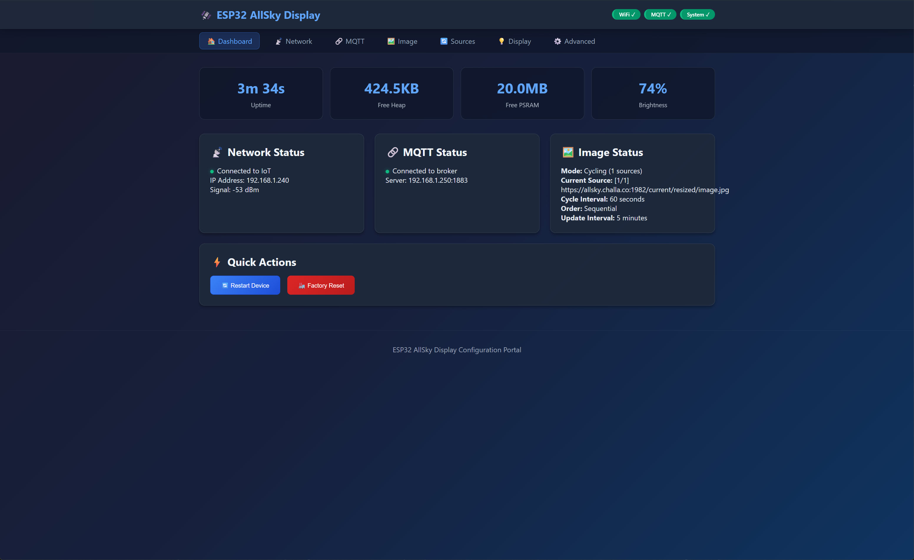
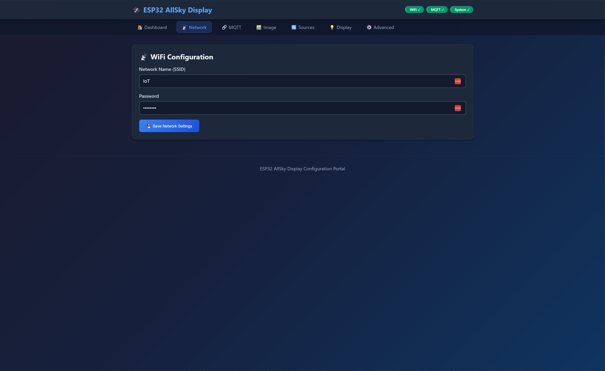
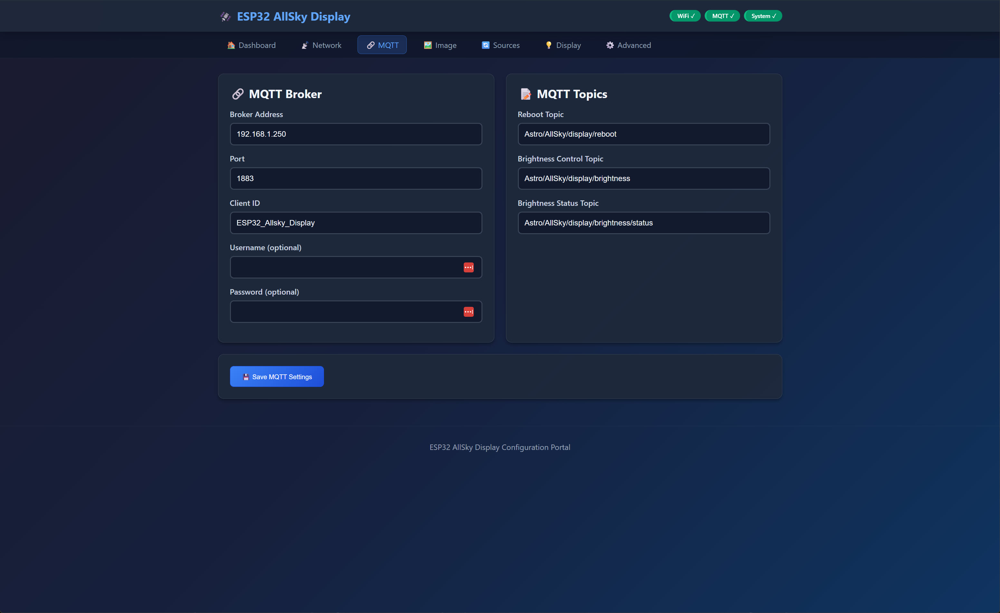
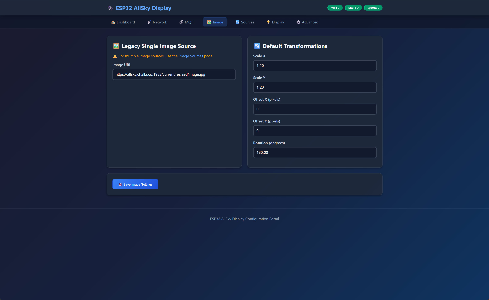
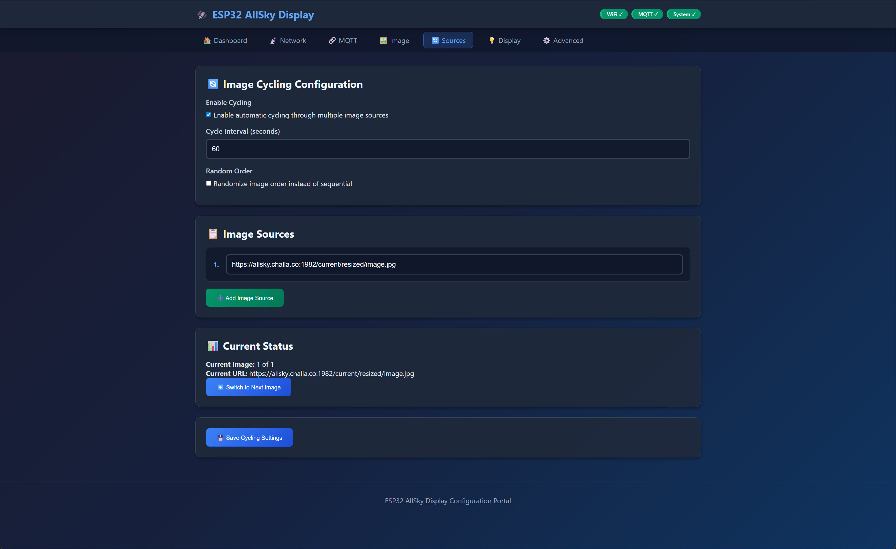
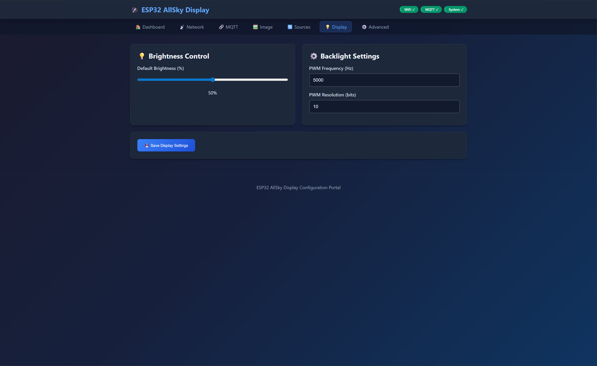
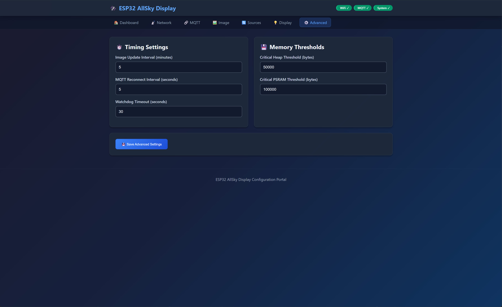
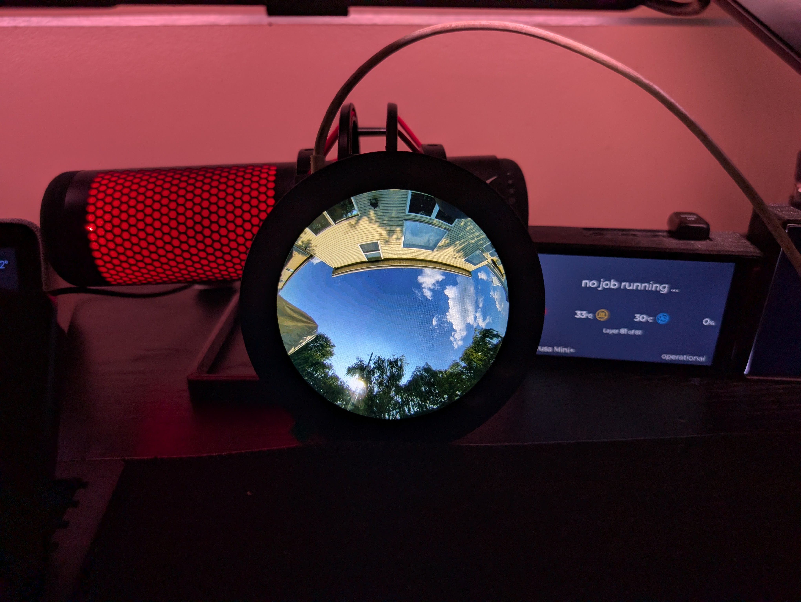

# ESP32-P4 AllSky Display

A comprehensive image display system for ESP32-P4 with advanced features including multi-image cycling, hardware acceleration, web configuration, and MQTT integration.

## Features

### Image Display & Processing
- **Multi-Image Cycling**: Automatically cycle through multiple image sources
- **Hardware Acceleration**: PPA (Pixel Processing Accelerator) for fast scaling and rotation
- **Real-time Transformations**: Scale, rotate, and position images dynamically
- **Smart Screen Clearing**: Optimized rendering to prevent flickering
- **JPEG Support**: Efficient JPEG decoding with format validation
- **Memory Management**: PSRAM-optimized buffering for smooth performance

### Image Cycling System
- **Multiple Image Sources**: Support for up to 10 different image URLs
- **Cycling Modes**: Sequential or random order
- **Configurable Intervals**: Set custom cycling and update intervals
- **Persistent State**: Remembers current image across reboots
- **Real-time Control**: Change cycling settings through web interface

### Web Configuration Interface
- **Modern UI**: Clean, responsive web interface
- **Real-time Status**: Live system and image status monitoring
- **Network Configuration**: WiFi and MQTT settings
- **Image Source Management**: Add, remove, and configure image sources
- **Display Settings**: Brightness, update intervals, and cycling options
- **System Monitoring**: Memory usage, uptime, and health status

### Interactive Controls
- **Serial Commands**: Real-time image manipulation via serial interface
- **Transform Controls**: Scale (+/-), Move (WASD), Rotate (QE)
- **Brightness Control**: Adjust display brightness (L/K)
- **System Commands**: Memory info (M), Network info (I), PPA status (P)
- **Reset Functions**: Transform reset (R), System reboot (B)

### MQTT Integration
- **Remote Control**: Control brightness and system functions via MQTT
- **Status Publishing**: Publish brightness and system status
- **Configurable Topics**: Customizable MQTT topic structure
- **Secure Connection**: Support for authenticated MQTT connections

### System Monitoring & Reliability
- **Watchdog Protection**: Comprehensive watchdog timer management
- **Memory Monitoring**: Real-time heap and PSRAM usage tracking
- **Network Health**: WiFi connection monitoring and recovery
- **Error Handling**: Robust error detection and recovery mechanisms
- **Performance Metrics**: Download speeds, processing times, and system health

### Hardware Acceleration
- **PPA Integration**: Hardware-accelerated image scaling and rotation
- **Optimized Rendering**: Direct bitmap drawing for maximum performance
- **Memory Efficiency**: Smart buffer management for large images
- **Fallback Support**: Software processing when hardware acceleration unavailable

## Demo Video

**Watch the ESP32-P4 AllSky Display in action:**
[](https://www.youtube.com/watch?v=pPAgbkPNvvY)

[View on YouTube](https://www.youtube.com/watch?v=pPAgbkPNvvY)

## Screenshots

Here are some screenshots showcasing the ESP32-P4 AllSky Display system in operation:

### System Display Screenshots















### Hardware Setup

*ESP32-P4 with DSI Display setup*

## Hardware Requirements

- **ESP32-P4** microcontroller
- **DSI Display** compatible with ESP32-P4
- **PSRAM** enabled (required for image buffering)
- **WiFi Connection** for image downloading

## Installation

1. **Arduino IDE Setup**:
   - Install ESP32 board support (version 3.2.1 or later)
   - Enable PSRAM in Tools menu
   - Install required libraries (see Dependencies section)

2. **Upload Code**:
   - Flash the main sketch to your ESP32-P4
   - Configure WiFi credentials through web interface or serial

3. **Configuration**:
   - Access web interface at device IP address
   - Configure image sources and cycling settings
   - Set update intervals and display preferences

## Dependencies

- **ESP32 Core** (3.2.1+)
- **GFX Library for Arduino** (1.6.0+)
- **JPEGDEC** (1.8.2+)
- **PubSubClient** (2.8+)
- **ElegantOTA** (3.1.7+)
- **Built-in Libraries**: HTTPClient, WebServer, WiFi, Preferences

## Configuration

### Web Interface Configuration
- **Access**: `http://[device-ip]/`
- **Image Sources**: Add/remove URLs in cycling configuration
- **Display Settings**: Brightness, update intervals
- **Network Settings**: WiFi and MQTT configuration
- **System Monitor**: Real-time status and diagnostics

### Serial Commands
```
+/-   : Scale image up/down
W/S   : Move image up/down
A/D   : Move image left/right
Q/E   : Rotate image 90° CCW/CW
R     : Reset all transformations
L/K   : Brightness up/down
B     : Reboot device
M     : Memory information
I     : Network information
P     : PPA acceleration status
T     : MQTT status
H/?   : Show help
```

## System Architecture

### Modular Design
- **Config Management**: Persistent storage with web interface
- **Display Manager**: Hardware abstraction and rendering
- **Network Manager**: WiFi connectivity and monitoring
- **MQTT Manager**: Message broker integration
- **System Monitor**: Health monitoring and watchdog
- **PPA Accelerator**: Hardware acceleration interface

### Memory Management
- **PSRAM Utilization**: Large image buffers stored in PSRAM
- **Smart Buffering**: Multiple buffers for smooth transitions
- **Memory Monitoring**: Real-time usage tracking and alerts

### Error Handling
- **Watchdog Protection**: Prevents system freezes
- **Network Recovery**: Automatic WiFi reconnection
- **Download Timeouts**: Configurable timeout protection
- **Format Validation**: JPEG header verification

## Performance Features

### Download Optimization
- **Chunked Downloads**: Efficient streaming with progress monitoring
- **Timeout Protection**: Multiple timeout layers prevent hanging
- **Connection Management**: Automatic cleanup and retry logic
- **Progress Feedback**: Real-time download status

### Rendering Optimization
- **Hardware Acceleration**: PPA for scaling and rotation
- **Smart Clearing**: Minimal screen updates to prevent flickering
- **Buffer Management**: Optimized memory usage
- **Transform Caching**: Efficient transformation pipeline

### System Monitoring
- **Performance Metrics**: Download speeds, processing times
- **Memory Tracking**: Heap and PSRAM usage monitoring
- **Health Checks**: System stability monitoring
- **Debug Information**: Comprehensive logging system

## Troubleshooting

### Common Issues

1. **Compilation Errors**:
   - Ensure PSRAM is enabled in Arduino IDE
   - Check ESP32 core version (3.2.1+)
   - Verify all dependencies are installed

2. **Memory Issues**:
   - Monitor PSRAM usage through serial output
   - Reduce image buffer sizes if needed
   - Check for memory leaks in debug output

3. **Network Problems**:
   - Verify WiFi credentials
   - Check image URL accessibility
   - Monitor network status through web interface

4. **Display Issues**:
   - Verify DSI display compatibility
   - Check display initialization in serial output
   - Ensure proper wiring and power supply

### Debug Information
- **Serial Output**: Comprehensive debugging information
- **Web Interface**: Real-time system status
- **Memory Monitor**: Heap and PSRAM usage tracking
- **Network Status**: Connection monitoring and diagnostics

## Contributing

1. Fork the repository
2. Create a feature branch
3. Make your changes
4. Test thoroughly
5. Submit a pull request

## License

This project is open source. Please check the license file for details.

## Support

For issues, feature requests, or questions:
- Create an issue in the GitHub repository
- Check the troubleshooting section above
- Monitor serial output for debugging information
