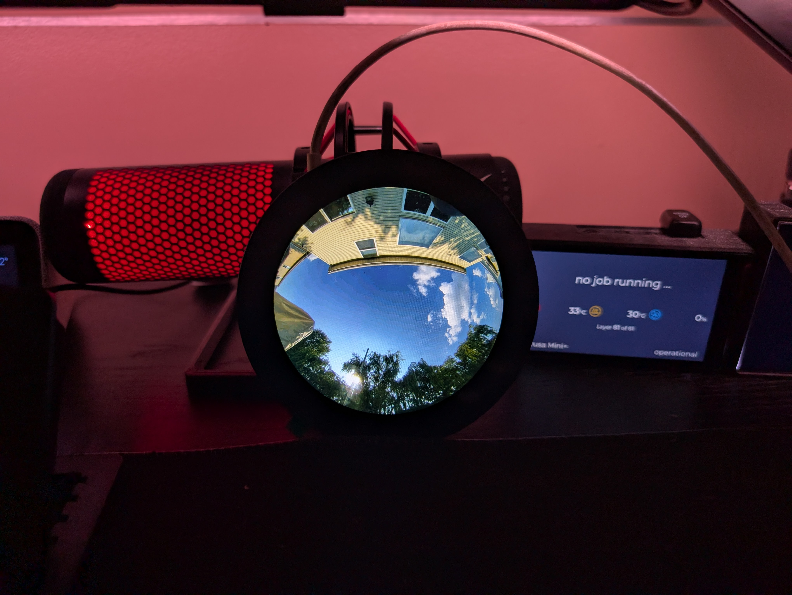
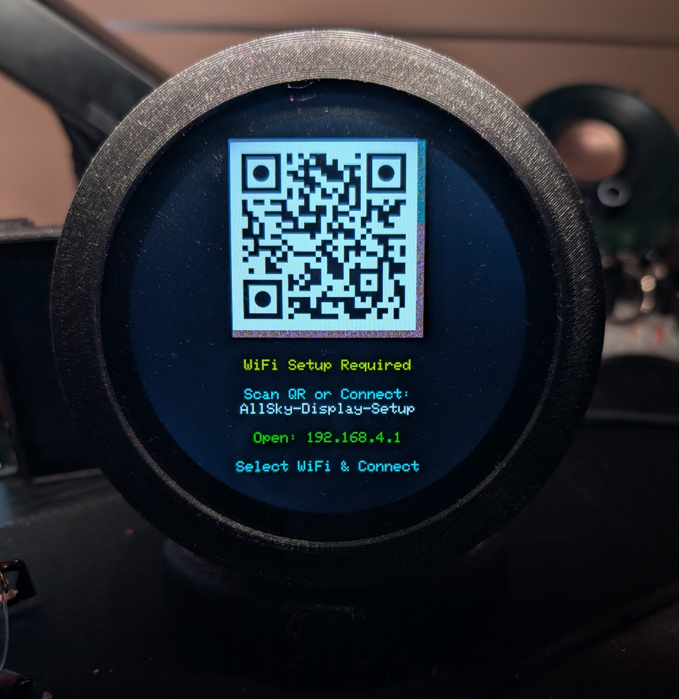
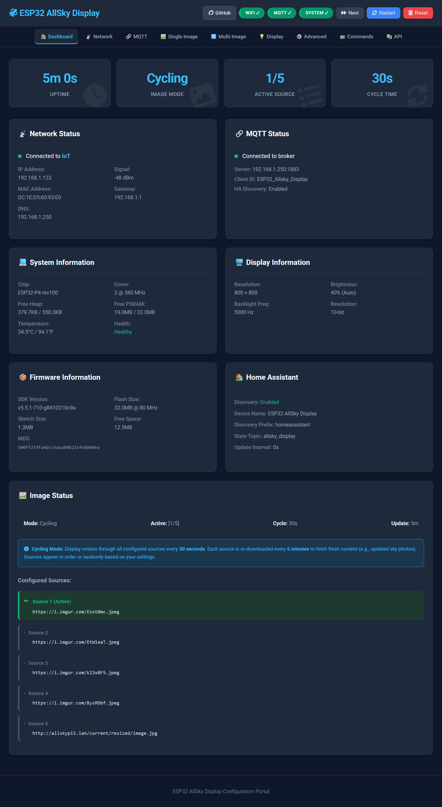
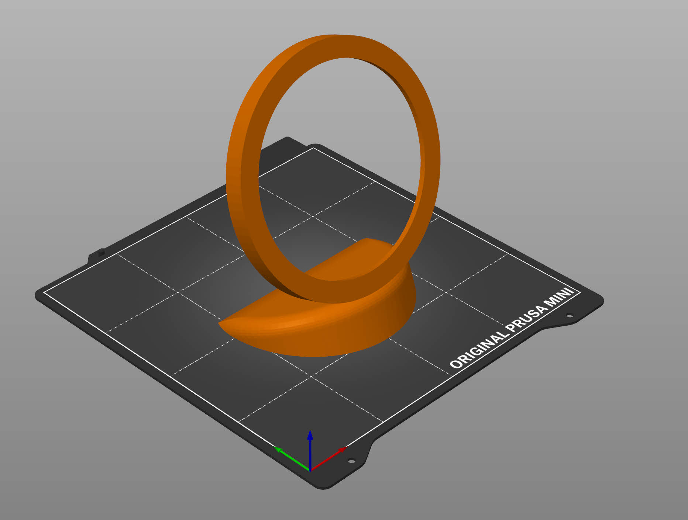

# ESP32-P4 AllSky Display

This project enables the use of an ESP32-P4 display into an all-sky camera viewer. It features multi-image cycling, hardware acceleration, and seamless integration with Home Assistant.

3.6" Screen


4" Screen


---

## Demo Video

[](https://www.youtube.com/watch?v=pPAgbkPNvvY)

[Click here to watch on YouTube](https://www.youtube.com/watch?v=pPAgbkPNvvY)

---

## Build Status and Badges

[](https://github.com/chvvkumar/ESP32-P4-Allsky-Display/actions/workflows/arduino-compile.yml)
[](https://github.com/chvvkumar/ESP32-P4-Allsky-Display/releases/latest)


[](https://deepwiki.com/chvvkumar/ESP32-P4-Allsky-Display)

---

## Documentation

Comprehensive documentation for both users and developers is organized as follows:

### Getting Started
- **[Hardware Requirements](docs/01_hardware.md)** - Details on supported displays, ESP32-P4 specifications, and required libraries.
- **[Installation Guide](docs/02_installation.md)** - Instructions for flashing firmware, compiling from source, and initial WiFi setup.
- **[Configuration Guide](docs/03_configuration.md)** - Guide for Web UI, MQTT, multi-image setup, and serial commands.

### Using Your Display
- **[Features and Usage](docs/04_features.md)** - Information on multi-image cycling, touch controls, health monitoring, and Home Assistant integration.
- **[OTA Updates](docs/05_ota_updates.md)** - Procedures for wireless firmware updates with automatic rollback.
- **[Troubleshooting](docs/06_troubleshooting.md)** - Solutions for common issues, crash diagnosis, and support channels.

### Developer Documentation
- **[System Architecture](docs/developer/architecture.md)** - Overview of system design, memory layout, and control flow.
- **[API Reference](docs/developer/api_reference.md)** - Documentation for classes and REST API endpoints.

---

## Key Features

- **Multi-Image Display:** Automatically cycle through up to 10 image sources or control via API.
- **Flexible Update Modes:** Choose between automatic cycling or API-triggered refresh for external control (v-snd-0.62+).
- **Runtime Display Selection:** Switch between 3.4" and 4.0" displays via the Web UI without recompilation (v-snd-0.61+).
- **Enhanced Brightness Control:** Three modes available: Manual, MQTT Auto, or Home Assistant with clear UI indication (v-snd-0.61+).
- **AllSky Module:** Dedicated [allsky_esp32round module](https://github.com/AllskyTeam/allsky-modules/tree/master/allsky_esp32round) by [Alex](https://github.com/Alex-developer) for automatic image resizing for both display sizes.
- **Hardware Accelerated:** Utilizes ESP32-P4 PPA for fast scaling and rotation (385-507ms render time).
- **High Resolution:** Supports images up to 1448×1448 pixels with 2× scaling capability.
- **Per-Image Transforms:** Individual scale, offset, and rotation settings for each image.
- **Touch Controls:** Tap to navigate; double-tap to toggle modes.
- **Home Assistant Ready:** Features auto-discovery via MQTT with full control capabilities.
- **Web Configuration:** Modern, responsive UI for managing all settings.
- **OTA Updates:** Wireless firmware updates with automatic rollback functionality.
- **Easy Setup:** Captive portal for WiFi configuration featuring a QR code.

---

## Quick Start

### 1. Hardware Required

- [Waveshare 3.4" ESP32-P4 Touch LCD](https://www.waveshare.com/esp32-p4-wifi6-touch-lcd-3.4c.htm) (800×800) - **Tested and Working**
- [Waveshare 4.0" ESP32-P4 Touch LCD](https://www.waveshare.com/wiki/ESP32-P4-WIFI6-Touch-LCD-4C) (720×720) - **Tested and Working**

**Requirements:** ESP32-P4 with WiFi 6, DSI display, GT911 touch, and PSRAM.

**Note:** Both displays are supported. Select the appropriate display type in the Web UI System settings after flashing (v-snd-0.61+).

**Full Details:** [Hardware Requirements Guide](docs/01_hardware.md)

### 2. Flash Firmware

**Download Latest Release:**
- Navigate to [Releases](https://github.com/chvvkumar/ESP32-P4-Allsky-Display/releases/latest).
- Download **`ESP32-P4-Allsky-Display-Factory.bin`** (for initial USB installation).

**Important:** Use the **`-Factory.bin`** file for USB flashing. The **`-OTA.bin`** file is intended for wireless updates only.

**Flash using esptool:**
```powershell
esptool.py --chip esp32p4 --port COM3 --baud 921600 write_flash 0x0 ESP32-P4-Allsky-Display-Factory.bin
```

**Universal Display Support:** Pre-compiled firmware is compatible with both 3.4" (800×800) and 4.0" (720×720) displays. Select the display type in the Web UI System settings after flashing.

**Full Instructions:** [Installation Guide](docs/02_installation.md)

### 3. WiFi Setup

On first boot, the device establishes a WiFi network:

1. **Connect to:** `AllSky-Display-Setup` (no password).
2. **Scan QR Code** on the display or navigate to `http://192.168.4.1`.
3. **Select network**, enter password, and click Connect.
4. **Device reboots** and displays the IP address.



**Full Details:** [Installation Guide - First Boot](docs/02_installation.md#first-boot--wifi-setup)

### 4. Configure via Web Interface

Access `http://[device-ip]:8080/` to configure:
- Image sources (up to 10 URLs).
- MQTT and Home Assistant settings.
- Display transforms and brightness.
- Cycle intervals.



**Full Guide:** [Configuration Guide](docs/03_configuration.md)

---

## Home Assistant Integration


**Auto-Discovery:** Enable MQTT in the web interface; the device will appear automatically.

**Control:** Manage brightness, cycling, image selection, transforms, and system actions.

**Full Integration Guide:** [Features - Home Assistant](docs/04_features.md#home-assistant-integration)

---

## Optional 3D Printed Case



**Download:** 
- [3.4" Display Stand](https://www.printables.com/model/1352883-desk-stand-for-waveshare-esp32-p4-wifi6-touch-lcd)
- [4" Display Stand](https://www.printables.com/model/1520845-desk-stand-for-waveshare-esp32-p4-wifi6-touch-lcd)

---

## Complete Documentation Map

### User Documentation
1. [Hardware Requirements](docs/01_hardware.md) - Displays, ESP32-P4, libraries, wiring.
2. [Installation Guide](docs/02_installation.md) - Flash firmware, compile from source, WiFi setup.
3. [Configuration Guide](docs/03_configuration.md) - Web UI, MQTT, images, serial commands.
4. [Features and Usage](docs/04_features.md) - Controls, health monitoring, Home Assistant.
5. [OTA Updates](docs/05_ota_updates.md) - Wireless updates, A/B partitions, safety.
6. [Troubleshooting](docs/06_troubleshooting.md) - Common issues, crash diagnosis, diagnostics.

### Developer Documentation
- [System Architecture](docs/developer/architecture.md) - Design, memory layout, data flow.
- [API Reference](docs/developer/api_reference.md) - Classes, REST endpoints, MQTT topics.
