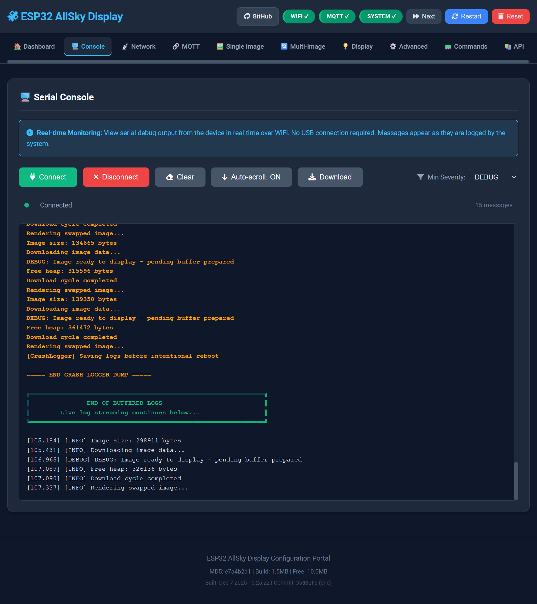

# Configuration Guide

Complete guide to configuring the ESP32-P4 AllSky Display firmware, covering both compile-time and runtime settings.

## Table of Contents
- [Configuration Overview](#configuration-overview)
- [Compile-Time Settings](#compile-time-settings)
- [Runtime Settings](#runtime-settings)
- [Settings Comparison Table](#settings-comparison-table)
- [Web UI Configuration](#web-ui-configuration)
- [MQTT Configuration](#mqtt-configuration)
- [Multi-Image Setup](#multi-image-setup)
- [Serial Commands Reference](#serial-commands-reference)
- [Advanced Configuration](#advanced-configuration)

---

## Configuration Overview

The ESP32-P4 AllSky Display has **two tiers of configuration**:

1. **Compile-Time Settings** - Hardcoded in `config.h` and `displays_config.h`
   - Require firmware re-flash to change
   - Define hardware parameters (display size, pin assignments, buffer sizes)
   - Set default values for runtime settings

2. **Runtime Settings** - Stored in NVS (Non-Volatile Storage)
   - Changed via Web UI, MQTT, or serial commands
   - Persist across reboots
   - Can be reset to defaults via "Factory Reset"

**Configuration Flow:**
```
Compile-Time Defaults (config.h)
         ↓
    NVS Storage (configStorage)
         ↓
   Runtime Values (used by firmware)
         ↓
  Web UI / MQTT / Serial Commands
         ↓
    saveConfig() → NVS
```

---

## Compile-Time Settings

### Display Hardware Selection

**File:** `displays_config.h`

```cpp
// Select your display hardware
#define SCREEN_3INCH_4_DSI 1    // 800×800 3.4" round display
#define SCREEN_4INCH_DSI 2      // 720×720 4.0" round display

#ifndef CURRENT_SCREEN
#define CURRENT_SCREEN SCREEN_3INCH_4_DSI  // <-- CHANGE HERE
#endif
```

**Effect:** 
- Changes display resolution (800×800 vs. 720×720)
- Adjusts touch I2C pin assignments
- Modifies vendor init sequences
- **Requires:** Clean build and re-flash

**How to Change:**
1. Edit `displays_config.h`
2. Change `CURRENT_SCREEN` to desired display
3. Delete `build/` folder
4. Run `compile-and-upload.ps1` to recompile
5. Upload new firmware

---

### Memory Buffer Sizes

**File:** `config.h`

```cpp
// Memory allocation sizes
#define IMAGE_BUFFER_MULTIPLIER 1        // Display size × 1 for downloads
#define FULL_IMAGE_BUFFER_SIZE (4 * 1024 * 1024)  // 4MB max image size
#define SCALED_BUFFER_MULTIPLIER 4       // 4× display for PPA operations
```

**Calculations:**

| Buffer | Formula | Size (800×800) | Purpose |
|--------|---------|----------------|---------|
| **imageBuffer** | w × h × 2 × `IMAGE_BUFFER_MULTIPLIER` | 1.28 MB | HTTP download scratch |
| **fullImageBuffer** | Fixed `FULL_IMAGE_BUFFER_SIZE` | 4.00 MB | Active displayed image |
| **pendingFullImageBuffer** | Same as `fullImageBuffer` | 4.00 MB | Next image (double-buffer) |
| **scaledBuffer** | w × h × 2 × `SCALED_BUFFER_MULTIPLIER` | 5.12 MB | PPA transformation output |

**Max Scale Factor:** `sqrt(SCALED_BUFFER_MULTIPLIER)`
- `SCALED_BUFFER_MULTIPLIER = 4` → Max scale = 2.0×
- `SCALED_BUFFER_MULTIPLIER = 9` → Max scale = 3.0×
- `SCALED_BUFFER_MULTIPLIER = 16` → Max scale = 4.0×

**To Increase Max Scale:**
```cpp
// Allow up to 3.0× scaling
#define SCALED_BUFFER_MULTIPLIER 9
```
**Cost:** Scaled buffer increases to 11.52 MB (total PSRAM usage ~22 MB)

**Max Image Dimensions:**
```cpp
#define MAX_IMAGE_DIMENSION (int)(sqrtf(FULL_IMAGE_BUFFER_SIZE / 2))
// Result: sqrt(4MB / 2 bytes) = 1448 pixels
```

**Limits:**
- Images larger than 1448×1448 will be rejected (exceeds buffer)
- Scale factors exceeding `MAX_SCALE` will fall back to software rendering

---

### System Timing

**File:** `config.h`

```cpp
// System timing intervals (milliseconds)
#define UPDATE_INTERVAL 120000           // 2 minutes between image updates
#define FORCE_CHECK_INTERVAL 900000      // Force check every 15 minutes
#define WATCHDOG_TIMEOUT_MS 30000        // 30 second watchdog (for slow downloads)
#define MEMORY_CHECK_INTERVAL 30000      // Check memory every 30 seconds
#define IMAGE_PROCESS_TIMEOUT 5000       // 5 second image processing timeout
```

**Recommended Values:**
- **UPDATE_INTERVAL:** 60000-300000 ms (1-5 minutes) for most use cases
- **WATCHDOG_TIMEOUT_MS:** 30000 ms minimum (accommodates slow network and large images)
- **MEMORY_CHECK_INTERVAL:** 30000 ms (balance between monitoring and overhead)

**Note:** `UPDATE_INTERVAL` can be changed at runtime via Web UI (becomes default).

---

### Network Timeouts

**File:** `config.h`

```cpp
// Network timeout configuration
#define HTTP_CONNECT_TIMEOUT 8000        // 8 seconds to establish TCP connection
#define HTTP_REQUEST_TIMEOUT 10000       // 10 seconds for HTTP response headers
#define DOWNLOAD_CHUNK_TIMEOUT 8000      // 8 seconds per 1KB chunk
#define TOTAL_DOWNLOAD_TIMEOUT 90000     // 90 seconds maximum for entire download
#define DNS_RESOLUTION_TIMEOUT 5000      // 5 seconds for DNS lookup
```

**Adjust for slow networks:**
```cpp
#define HTTP_CONNECT_TIMEOUT 15000       // 15 seconds (slow WiFi)
#define TOTAL_DOWNLOAD_TIMEOUT 180000    // 3 minutes (large images)
```

---

### Default Transform Settings

**File:** `config.h`

```cpp
// Image transformation defaults
#define DEFAULT_SCALE_X 1.2f       // Horizontal scale factor
#define DEFAULT_SCALE_Y 1.2f       // Vertical scale factor
#define DEFAULT_OFFSET_X 0         // Horizontal offset (pixels)
#define DEFAULT_OFFSET_Y 0         // Vertical offset (pixels)
#define DEFAULT_ROTATION 0.0f      // Rotation angle (degrees)
```

**Effect:** Initial values for new images, can be overridden per-image via Web UI.

**Common Presets:**
```cpp
// Fit to screen (no cropping)
#define DEFAULT_SCALE_X 1.0f
#define DEFAULT_SCALE_Y 1.0f

// Fill screen (slight crop)
#define DEFAULT_SCALE_X 1.25f
#define DEFAULT_SCALE_Y 1.25f

// Crop circular fisheye to square display
#define DEFAULT_SCALE_X 1.5f
#define DEFAULT_SCALE_Y 1.5f
```

---

### Hardware Pin Assignments

**File:** `config.h` and `displays_config.h`

```cpp
// Backlight control
#define BACKLIGHT_PIN 26                 // GPIO26 for PWM
#define BACKLIGHT_CHANNEL 0              // LEDC channel 0
#define BACKLIGHT_FREQ 5000              // 5kHz PWM frequency
#define BACKLIGHT_RESOLUTION 10          // 10-bit (0-1023)
#define DEFAULT_BRIGHTNESS 50            // 50% brightness
```

**Touch Controller (per display):**
```cpp
// 3.4" display
.i2c_sda_pin = 8,
.i2c_scl_pin = 18,

// 4.0" display
.i2c_sda_pin = 8,
.i2c_scl_pin = 9,
```

**Changing Pins:**
1. Edit `displays_config.h` for your display type
2. Update `.i2c_sda_pin` and `.i2c_scl_pin`
3. Recompile and upload

---

## Runtime Settings

### WiFi Configuration

**Configured via:** Captive Portal (first boot) or Web UI

**Parameters:**
- **SSID:** WiFi network name (max 32 characters)
- **Password:** WiFi password (max 64 characters)

**First Boot (Captive Portal):**
1. Device creates AP: `AllSky-Display-Setup` (no password)
2. Connect phone/PC to AP
3. Scan QR code or navigate to `192.168.4.1`
4. Select WiFi network and enter password
5. Device saves credentials and reboots


**Web UI Change:**
1. Navigate to `http://allskyesp32.lan:8080/network`
2. Enter new SSID and password
3. Click "Save Configuration"
4. Device will reconnect automatically

**Serial Command:**
```
W:<SSID>:<PASSWORD>
Example: W:MyNetwork:MyPassword123
```

**NVS Storage:**
- Key: `wifi_ssid`, `wifi_password`
- Namespace: `config`
- Persists until factory reset

---

### Image Sources

**Configured via:** Web UI → Image Configuration

**Single Image Mode:**
1. Navigate to `http://allskyesp32.lan:8080/image`
2. Enter image URL in "Legacy Image URL" field
3. Set "Enable Multi-Image Cycling" to OFF
4. Click "Save"

**Multi-Image Mode:**
1. Navigate to `http://allskyesp32.lan:8080/image`
2. Set "Enable Multi-Image Cycling" to ON
3. Click "Add Image Source" for each URL
4. Configure cycle interval (10 seconds - 1 hour)
5. Enable "Random Order" if desired
6. Click "Save Configuration"


**Per-Image Transforms:**
Each image can have independent transform settings:
```
Image 1: Scale 1.5×, Offset +50,+0, Rotation 0°
Image 2: Scale 1.2×, Offset -20,+30, Rotation 90°
Image 3: Scale 1.8×, Offset 0,-50, Rotation 180°
```

**To Configure:**
1. Select image from dropdown: "Image 1/10"
2. Adjust sliders: Scale X/Y, Offset X/Y, Rotation
3. Click "Apply Transform"
4. Repeat for each image
5. Click "Save Configuration"

**Quick Actions:**
- **Copy Defaults to All:** Apply default transform to all images
- **Next Image:** Manually advance to next image
- **Clear All Sources:** Remove all configured URLs

---

### MQTT Configuration

**Configured via:** Web UI → MQTT Configuration

**Parameters:**
- **Server:** MQTT broker hostname or IP (e.g., `192.168.1.100` or `homeassistant.local`)
- **Port:** MQTT port (default: 1883)
- **Username:** MQTT user (optional, leave blank for anonymous)
- **Password:** MQTT password (optional)
- **Client ID:** Unique client identifier (default: `allsky_display_<MAC>`)

**Home Assistant Integration:**
- **Discovery Enabled:** ON (publishes HA discovery messages)
- **Device Name:** Display name in HA (default: "AllSky Display")
- **Discovery Prefix:** MQTT discovery topic prefix (default: `homeassistant`)
- **State Topic:** Main state publishing topic (default: `homeassistant/allsky_display/state`)

**Configuration Steps:**
1. Navigate to `http://allskyesp32.lan:8080/mqtt`
2. Enter broker details
3. Enable "MQTT Discovery" for Home Assistant
4. Click "Save Configuration"
5. Device will connect to MQTT broker automatically

**Verification:**
```bash
# Subscribe to state topic
mosquitto_sub -h homeassistant.local -t "homeassistant/allsky_display/#" -v

# Expected output (every 60 seconds):
homeassistant/allsky_display/state {"brightness":50,"uptime":12345,"memory":1234567,...}
homeassistant/allsky_display/availability online
```

**Home Assistant Auto-Discovery:**

**Entities Created:**
- **Light:** Backlight brightness control (0-100%)
- **Switch:** Cycling mode toggle, image source toggles
- **Number:** Scale X/Y, Offset X/Y sliders
- **Select:** Rotation angle dropdown (0°, 90°, 180°, 270°)
- **Button:** "Next Image" trigger, "Restart Device" trigger
- **Sensor:** Uptime, free memory, WiFi signal, current image index

**Discovery Topics:**
```
homeassistant/light/allsky_display_backlight/config
homeassistant/switch/allsky_display_cycling/config
homeassistant/number/allsky_display_scale_x/config
homeassistant/sensor/allsky_display_uptime/config
... (20+ entities total)
```

**Manual Discovery Trigger:**
If entities don't appear automatically:
1. Restart MQTT Manager via serial command `M` (triggers reconnect)
2. Check MQTT broker logs for discovery messages
3. Verify HA is subscribed to `homeassistant/#`
4. Check HA Developer Tools → MQTT for incoming messages


---

### Display Settings

**Configured via:** Web UI → Display Configuration or MQTT

**Parameters:**
- **Brightness:** 0-100% (PWM duty cycle)
- **Default Scale X/Y:** Horizontal/vertical scale factors
- **Default Offset X/Y:** Pixel offsets for centering
- **Default Rotation:** Rotation angle (0, 90, 180, 270)

**Web UI:**
1. Navigate to `http://allskyesp32.lan:8080/display`
2. Adjust "Brightness" slider (0-100)
3. Set default transforms (applied to new images)
4. Click "Save Configuration"


**MQTT Control:**
```bash
# Set brightness to 75%
mosquitto_pub -h homeassistant.local \
  -t "homeassistant/allsky_display/light/command" \
  -m '{"brightness":75}'

# Turn off display (brightness 0)
mosquitto_pub -h homeassistant.local \
  -t "homeassistant/allsky_display/light/command" \
  -m '{"state":"OFF"}'
```

**Home Assistant:**
```yaml
# In configuration.yaml (auto-discovered via MQTT)
light:
  - platform: mqtt
    name: "AllSky Display Backlight"
    state_topic: "homeassistant/allsky_display/state"
    command_topic: "homeassistant/allsky_display/light/command"
    brightness_scale: 100
```

---

### Advanced Settings

**Configured via:** Web UI → Advanced Configuration

**Parameters:**
- **Update Interval:** Time between image updates (milliseconds)
- **Watchdog Timeout:** Watchdog timer timeout (milliseconds)
- **Critical Heap Threshold:** Memory warning level (bytes)
- **Critical PSRAM Threshold:** PSRAM warning level (bytes)
- **MQTT Reconnect Interval:** Time between MQTT reconnect attempts (milliseconds)

**Recommended Values:**

| Setting | Default | Minimum | Maximum | Notes |
|---------|---------|---------|---------|-------|
| **Update Interval** | 120000 ms (2 min) | 60000 ms (1 min) | 3600000 ms (1 hr) | Balance freshness vs. bandwidth |
| **Watchdog Timeout** | 30000 ms (30 sec) | 15000 ms (15 sec) | 60000 ms (1 min) | Must accommodate slow downloads |
| **Heap Threshold** | 50000 bytes (50 KB) | 20000 bytes (20 KB) | 100000 bytes (100 KB) | Lower = more sensitive warnings |
| **PSRAM Threshold** | 100000 bytes (100 KB) | 50000 bytes (50 KB) | 500000 bytes (500 KB) | Lower = earlier warnings |

**Configuration:**
1. Navigate to `http://allskyesp32.lan:8080/advanced`
2. Adjust values (be cautious with watchdog timeout)
3. Click "Save Configuration"
4. Some changes require reboot to take effect

---

## Settings Comparison Table

This table clarifies which settings are **compile-time** (require re-flash) vs. **runtime** (configurable via Web UI):

| Setting | Compile-Time | Runtime | Location | Requires Re-flash? |
|---------|--------------|---------|----------|-------------------|
| **Hardware** |
| Display Type (3.4" vs. 4.0") | ✅ | ❌ | `displays_config.h` | ✅ Yes |
| Display Resolution | ✅ | ❌ | `displays_config.h` | ✅ Yes |
| Touch I2C Pins | ✅ | ❌ | `displays_config.h` | ✅ Yes |
| Backlight GPIO | ✅ | ❌ | `config.h` | ✅ Yes |
| **Memory** |
| Image Buffer Size | ✅ | ❌ | `config.h` | ✅ Yes |
| Full Image Buffer Size | ✅ | ❌ | `config.h` | ✅ Yes |
| Scaled Buffer Multiplier | ✅ | ❌ | `config.h` | ✅ Yes |
| Max Scale Factor | ✅ Calculated | ❌ | `config.h` | ✅ Yes |
| Max Image Dimensions | ✅ Calculated | ❌ | `config.h` | ✅ Yes |
| **Network** |
| WiFi SSID | ⚠️ Fallback | ✅ Primary | `config.cpp` / Web UI | ❌ No |
| WiFi Password | ⚠️ Fallback | ✅ Primary | `config.cpp` / Web UI | ❌ No |
| HTTP Timeouts | ✅ | ❌ | `config.h` | ✅ Yes |
| DNS Timeout | ✅ | ❌ | `config.h` | ✅ Yes |
| NTP Server | ⚠️ Default | ✅ Configurable | `config.cpp` / Web UI | ❌ No |
| Timezone | ⚠️ Default | ✅ Configurable | `config.cpp` / Web UI | ❌ No |
| **MQTT** |
| MQTT Server | ⚠️ Default | ✅ Configurable | `config.cpp` / Web UI | ❌ No |
| MQTT Port | ⚠️ Default | ✅ Configurable | `config.cpp` / Web UI | ❌ No |
| MQTT Username | ⚠️ Default | ✅ Configurable | `config.cpp` / Web UI | ❌ No |
| MQTT Password | ⚠️ Default | ✅ Configurable | `config.cpp` / Web UI | ❌ No |
| HA Discovery Enabled | ⚠️ Default | ✅ Configurable | `config.cpp` / Web UI | ❌ No |
| **Images** |
| Image URLs | ⚠️ Defaults | ✅ Configurable | `config.cpp` / Web UI | ❌ No |
| Default Scale X/Y | ⚠️ Defaults | ✅ Configurable | `config.h` / Web UI | ❌ No |
| Default Offset X/Y | ⚠️ Defaults | ✅ Configurable | `config.h` / Web UI | ❌ No |
| Default Rotation | ⚠️ Default | ✅ Configurable | `config.h` / Web UI | ❌ No |
| Per-Image Transforms | ❌ None | ✅ All | Web UI only | ❌ No |
| Cycling Enabled | ⚠️ Default | ✅ Configurable | `config.cpp` / Web UI | ❌ No |
| Cycle Interval | ⚠️ Default | ✅ Configurable | `config.h` / Web UI | ❌ No |
| Random Order | ⚠️ Default | ✅ Configurable | `config.cpp` / Web UI | ❌ No |
| **Display** |
| Brightness | ⚠️ Default | ✅ Configurable | `config.h` / Web UI | ❌ No |
| PWM Frequency | ✅ | ❌ | `config.h` | ✅ Yes |
| PWM Resolution | ✅ | ❌ | `config.h` | ✅ Yes |
| **System** |
| Update Interval | ⚠️ Default | ✅ Configurable | `config.h` / Web UI | ❌ No (effective on reboot) |
| Watchdog Timeout | ⚠️ Default | ✅ Configurable | `config.h` / Web UI | ❌ No (effective on reboot) |
| Memory Thresholds | ⚠️ Defaults | ✅ Configurable | `config.h` / Web UI | ❌ No |
| Log Severity Filter | ⚠️ Default | ✅ Configurable | `config.h` / Web UI | ❌ No |

**Legend:**
- ✅ **Available:** Setting can be configured at this level
- ❌ **Not Available:** Setting cannot be configured at this level
- ⚠️ **Fallback/Default:** Compile-time value used as default if runtime value not set

**Key Takeaways:**
1. **Hardware changes always require re-flash** (display type, pins, buffer sizes)
2. **Network and MQTT settings are runtime-configurable** (no re-flash needed)
3. **Image sources and transforms are fully runtime** (Web UI only)
4. **Compile-time values serve as fallbacks** when runtime values haven't been configured

---

## Web UI Configuration

### Accessing the Web Interface

**URL:** `http://allskyesp32.lan:8080/` (mDNS hostname)  
**Alternative:** `http://<IP_ADDRESS>:8080/` (check serial monitor for IP)


**Pages:**
- **/** - Homepage with device status and quick stats
- **/network** - WiFi and NTP configuration
- **/mqtt** - MQTT broker and Home Assistant settings
- **/image** - Image sources, cycling, and per-image transforms
- **/display** - Brightness and default transform settings
- **/advanced** - System tuning (intervals, thresholds, watchdog)
- **/console** - Real-time WebSocket log viewer
- **/api/info** - JSON API with complete system state
- **/update** - ElegantOTA firmware upload

### Using the Console

**Access:** `http://allskyesp32.lan:8080/console`



**Features:**
- **Real-time logs:** All `LOG_*` macro messages stream to browser
- **Severity filtering:** Click severity buttons to show/hide levels
  - DEBUG (gray) - Verbose debugging
  - INFO (blue) - Normal operations
  - WARNING (yellow) - Non-critical issues
  - ERROR (red) - Errors (system continues)
  - CRITICAL (dark red) - Critical failures
- **Auto-scroll:** Automatically scrolls to newest messages
- **Message counter:** Shows total messages received this session
- **Download logs:** Export logs as text file for offline analysis
- **Crash logs:** Displays preserved crash logs from NVS/RTC memory

**Usage Tips:**
- **Filter during troubleshooting:** Hide DEBUG to focus on errors
- **Download before reset:** Save logs before factory reset or reboot
- **Monitor downloads:** Watch image download progress in real-time
- **Check memory:** INFO messages show free heap/PSRAM periodically

---

## Multi-Image Setup

### Example: 5 Weather Camera Feeds

**Scenario:** Display 5 different AllSky camera views, cycling every 30 seconds.

**Configuration:**
1. Navigate to `http://allskyesp32.lan:8080/image`
2. Enable "Multi-Image Cycling"
3. Set "Cycle Interval" to 30 seconds
4. Add image sources:
   ```
   Image 1: https://camera1.example.com/allsky/current.jpg
   Image 2: https://camera2.example.com/allsky/current.jpg
   Image 3: https://camera3.example.com/allsky/current.jpg
   Image 4: https://camera4.example.com/allsky/current.jpg
   Image 5: https://camera5.example.com/allsky/current.jpg
   ```
5. Configure per-image transforms:
   ```
   Image 1: Scale 1.5× (crop fisheye to square)
   Image 2: Scale 1.2×, Rotation 90° (portrait camera)
   Image 3: Scale 1.8×, Offset +0,+50 (center bright area)
   Image 4: Scale 1.3× (balanced view)
   Image 5: Scale 1.6×, Rotation 180° (inverted camera)
   ```
6. Enable "Random Order" if desired
7. Click "Save Configuration"

**Result:** Device cycles through all 5 images every 2.5 minutes (30s × 5), applying appropriate transforms to each.

### Image Size Optimization

**Recommended Dimensions:**
- 3.4" display (800×800): Use **800×800 to 1200×1200** source images
- 4.0" display (720×720): Use **720×720 to 1200×1200** source images

**AllSky Camera Resize Script:**

```bash
#!/bin/bash
INPUT_DIR="/home/pi/allsky/tmp"
OUTPUT_DIR="/home/pi/allsky/resized"
RESIZE_DIMENSIONS="720x720"  # or 800x800 for 3.4"

mkdir -p "${OUTPUT_DIR}"
/usr/bin/mogrify -path "${OUTPUT_DIR}" -resize "${RESIZE_DIMENSIONS}" "${INPUT_DIR}/image.jpg"
```

**Setup Options:**

1. **AllSky Module** (Recommended): Add script to AllSky Module Manager → Use `http://your-server/resized/image.jpg`
2. **Cron Job**: Run script every 1-10 minutes with `crontab -e`

---

## Serial Commands Reference

Connect via Serial Monitor at 9600 baud to access these commands:

### Navigation & Image Control

```
N : Next image (force update, reset cycle)
F : Refresh current image (download again)
T : Toggle cycling mode (on/off)
D : Download image now (manual trigger)
```

### Scale & Transform

```
+/- : Increase/Decrease scale by 0.1
W   : Move image up (offset Y -10px)
A   : Move image left (offset X -10px)
S   : Move image down (offset Y +10px)
D   : Move image right (offset X +10px)
Q   : Rotate counter-clockwise (-90°)
E   : Rotate clockwise (+90°)
R   : Reset all transforms to defaults
X   : Reset transforms (same as R)
```

### Display Control

```
L   : Increase brightness (+10%)
K   : Decrease brightness (-10%)
```

### System Information

```
I   : System information (uptime, version, config)
M   : Memory status (heap/PSRAM current and minimum)
V   : Version info (firmware, git commit, build date)
N   : Network status (IP, signal, MQTT connection)
S   : Complete system status (all info combined)
G   : Device health diagnostics report
H   : Help (show all commands)
?   : Help (same as H)
```

### System Actions

```
B   : Reboot device
F   : Factory reset (clear all NVS config)
C   : Clear crash logs from NVS
```

**Example Session:**
```
> M
Free Heap: 234567 bytes
Free PSRAM: 16384000 bytes
Min Heap: 198765 bytes
Min PSRAM: 15680000 bytes

> I
System Information:
  Uptime: 1234567 ms
  Firmware: v1.2.3
  Git Commit: abc123def
  Build Date: Dec 15 2025 19:30:45
  
> N
Network Status:
  WiFi: Connected
  SSID: MyNetwork
  IP: 192.168.1.100
  Signal: -65 dBm (Good)
  MQTT: Connected
```

---

## Advanced Configuration

### Custom Compile-Time Defaults

To set project-specific defaults without modifying `config.h`:

1. Create `config_override.h` (optional, not in repo):
   ```cpp
   #pragma once
   #define MY_WIFI_SSID "MyNetwork"
   #define MY_WIFI_PASSWORD "MyPassword"
   #define MY_MQTT_SERVER "192.168.1.100"
   #define MY_IMAGE_URL "https://myserver.com/image.jpg"
   ```

2. In `config.cpp`, use override values:
   ```cpp
   #ifdef MY_WIFI_SSID
   const char* WIFI_SSID = MY_WIFI_SSID;
   #else
   const char* WIFI_SSID = "DefaultSSID";
   #endif
   ```

3. Add to `.gitignore`:
   ```
   config_override.h
   ```

**Benefit:** Keep custom settings out of version control.

---

### Factory Reset

**Methods:**

1. **Web UI:**
   - Navigate to `http://allskyesp32.lan:8080/advanced`
   - Scroll to bottom
   - Click "Factory Reset" button
   - Confirm action
   - Device clears NVS and reboots to captive portal

2. **Serial Command:**
   ```
   F (press Enter)
   ```

3. **Physical Button (if implemented):**
   - Hold boot button during power-on
   - Wait for "Factory Reset" message
   - Release button

**What Gets Reset:**
- All WiFi credentials
- All MQTT settings
- All image sources and transforms
- All system thresholds and intervals
- Log severity filter

**What Persists:**
- Firmware version
- Crash logs (cleared separately via console)
- Boot count
- Compile-time defaults

---

## Summary

The ESP32-P4 AllSky Display uses a **two-tier configuration system**:

**Compile-Time:**
- Hardware parameters (display, pins, buffers)
- Memory sizes and limits
- Network timeout values
- Default/fallback values

**Runtime:**
- WiFi credentials and network settings
- MQTT broker and HA integration
- Image sources and per-image transforms
- Display brightness and system thresholds

**Best Practices:**
- Use Web UI for all runtime settings (persistent across reboots)
- Only modify compile-time settings when changing hardware or increasing performance limits
- Test configuration changes via Web UI before modifying code
- Use "Factory Reset" to recover from misconfiguration
- Monitor system logs (Web Console) when tuning advanced parameters

---

## Next Steps

- [Features Guide](04_features.md) - Explore all system capabilities
- [OTA Updates](05_ota_updates.md) - Wireless firmware updates
- [Troubleshooting](06_troubleshooting.md) - Common issues and solutions
- [Hardware Guide](01_hardware.md) - Hardware specifications and setup
- [Installation Guide](02_installation.md) - Step-by-step setup
