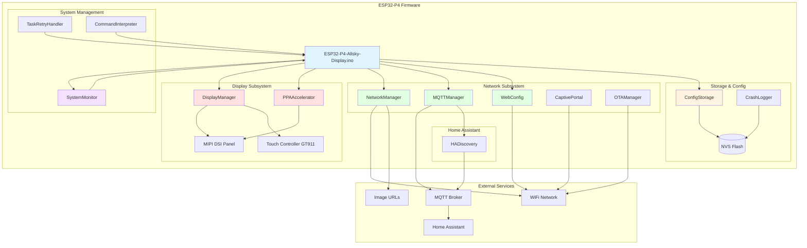
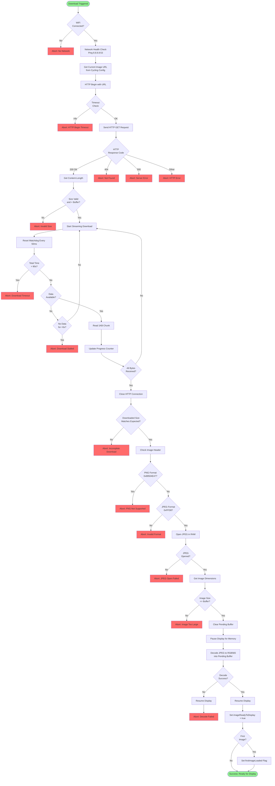

# ESP32-P4 AllSky Display - Architecture Documentation

## Table of Contents
- [System Overview](#system-overview)
- [Component Diagrams](#component-diagrams)
- [Control Flow](#control-flow)
- [Memory Architecture](#memory-architecture)
- [Module Descriptions](#module-descriptions)

---

## System Overview

The ESP32-P4 AllSky Display is a firmware application designed for the ESP32-P4 microcontroller that displays AllSky camera images on a MIPI DSI display. The system leverages hardware acceleration (PPA - Pixel Processing Accelerator) for image transformations and integrates with Home Assistant via MQTT for remote control.

**Key Features:**
- **Hardware-accelerated image rendering** using ESP32-P4's PPA engine
- **Multi-image cycling** with configurable intervals and random order
- **Touch control** via GT911 capacitive touch controller
- **Web-based configuration** with real-time WebSocket console
- **MQTT integration** with Home Assistant auto-discovery
- **OTA updates** with A/B partition rollback protection
- **Crash logging** with backtrace preservation in RTC memory and NVS
- **Captive portal** for initial WiFi setup with QR code

---

## Component Diagrams

### High-Level System Architecture



### Class Relationship Diagram

```mermaid
classDiagram
    class MainSketch {
        +setup()
        +loop()
        +downloadAndDisplayImage()
        +renderFullImage()
        +handleTouchGestures()
    }
    
    class DisplayManager {
        -Arduino_DSI_Display* gfx
        -int16_t displayWidth
        -int16_t displayHeight
        -int displayBrightness
        +begin() bool
        +getGFX() Arduino_DSI_Display*
        +setBrightness(int brightness)
        +clearScreen(uint16_t color)
        +drawBitmap(x, y, bitmap, w, h)
        +debugPrint(message, color)
        +pauseDisplay()
        +resumeDisplay()
    }
    
    class PPAAccelerator {
        -ppa_client_handle_t ppa_scaling_handle
        -uint16_t* ppa_src_buffer
        -uint16_t* ppa_dst_buffer
        +begin(width, height) bool
        +scaleRotateImage(src, srcW, srcH, dst, dstW, dstH, rotation) bool
        +scaleImage(src, srcW, srcH, dst, dstW, dstH) bool
        +isAvailable() bool
    }
    
    class NetworkManager {
        -bool wifiConnected
        -WiFiClient client
        +begin() bool
        +connectToWiFi()
        +isConnected() bool
        +getIPAddress() String
        +syncNTPTime()
        +initOTA()
        +handleOTA()
    }
    
    class MQTTManager {
        -WiFiClient wifiClient
        -PubSubClient mqttClient
        -bool mqttConnected
        +begin() bool
        +connect()
        +isConnected() bool
        +loop()
        +publishAvailabilityHeartbeat()
        +getClient() PubSubClient*
    }
    
    class WebConfig {
        -WebServer* server
        -WebSocketsServer* wsServer
        -bool serverRunning
        +begin(int port) bool
        +handleClient()
        +broadcastLog(message, color, severity)
        +isRunning() bool
        +loopWebSocket()
    }
    
    class ConfigStorage {
        -Preferences preferences
        +begin() bool
        +loadConfig()
        +saveConfig()
        +setWiFiSSID(ssid)
        +getImageURL() String
        +getCyclingEnabled() bool
        +setImageSource(index, url)
        +isWiFiProvisioned() bool
    }
    
    class SystemMonitor {
        -unsigned long lastWatchdogReset
        -size_t minFreeHeap
        -size_t minFreePsram
        +begin(timeoutMs) bool
        +resetWatchdog()
        +forceResetWatchdog()
        +checkSystemHealth()
        +getCurrentFreeHeap() size_t
        +getCurrentFreePsram() size_t
    }
    
    class CrashLogger {
        -char* ramLogBuffer
        -size_t ramWritePos
        -uint32_t bootCount
        +begin()
        +log(message)
        +markCrash()
        +wasLastBootCrash() bool
        +getRecentLogs() String
        +saveToNVS()
    }
    
    class OTAManager {
        -OTAUpdateStatus status
        -uint8_t progress
        +begin()
        +setProgress(percent)
        +displayProgress(operation, percent)
        +getStatus() OTAUpdateStatus
    }
    
    class HADiscovery {
        -PubSubClient* mqttClient
        -String deviceId
        -String baseTopic
        +begin(client)
        +publishDiscovery() bool
        +publishAvailability(online) bool
        +publishState() bool
        +handleCommand(topic, payload)
    }
    
    class CaptivePortal {
        -WiFiServer* dnsServer
        -bool configured
        +begin(ssid) bool
        +handleClient()
        +isConfigured() bool
        +stop()
    }
    
    class TaskRetryHandler {
        +registerTask(name, func, maxRetries)
        +process()
        +clear(name)
    }
    
    MainSketch --> DisplayManager
    MainSketch --> PPAAccelerator
    MainSketch --> NetworkManager
    MainSketch --> MQTTManager
    MainSketch --> WebConfig
    MainSketch --> ConfigStorage
    MainSketch --> SystemMonitor
    MainSketch --> CrashLogger
    MainSketch --> OTAManager
    MainSketch --> TaskRetryHandler
    
    DisplayManager --> PPAAccelerator : uses for scaling
    MQTTManager --> HADiscovery : publishes discovery
    MQTTManager --> ConfigStorage : reads settings
    WebConfig --> ConfigStorage : reads/writes config
    NetworkManager --> OTAManager : triggers updates
    CrashLogger --> SystemMonitor : monitors health
    HADiscovery --> MQTTManager : uses client
```



---

## Control Flow

### Startup Sequence (setup())

```mermaid
flowchart TD
    START([Firmware Boot]) --> WDT_DISABLE[Disable Bootloader Watchdog]
    WDT_DISABLE --> SERIAL[Initialize Serial 9600 baud]
    SERIAL --> CRASH_INIT[Initialize CrashLogger]
    CRASH_INIT --> CHECK_CRASH{Was Last Boot<br/>a Crash?}
    CHECK_CRASH -->|Yes| LOG_CRASH[Log Crash Warning]
    CHECK_CRASH -->|No| LOAD_CONFIG
    LOG_CRASH --> LOAD_CONFIG[Load Configuration from NVS]
    
    LOAD_CONFIG --> INIT_MONITOR[Initialize SystemMonitor<br/>with Watchdog Timeout]
    INIT_MONITOR --> ALLOC_MEM[Pre-allocate PSRAM Buffers<br/>BEFORE Display Init]
    
    ALLOC_MEM --> IMG_BUF{Image Buffer<br/>Allocated?}
    IMG_BUF -->|No| HALT_IMG[HALT: Out of Memory]
    IMG_BUF -->|Yes| FULL_BUF{Full Image Buffer<br/>4MB Allocated?}
    
    FULL_BUF -->|No| HALT_FULL[HALT: Out of Memory]
    FULL_BUF -->|Yes| PENDING_BUF{Pending Buffer<br/>4MB Allocated?}
    
    PENDING_BUF -->|No| HALT_PENDING[HALT: Out of Memory]
    PENDING_BUF -->|Yes| SCALED_BUF{Scaled Buffer<br/>5.12MB Allocated?}
    
    SCALED_BUF -->|No| HALT_SCALED[HALT: Out of Memory]
    SCALED_BUF -->|Yes| INIT_DISPLAY[Initialize Display Manager]
    
    INIT_DISPLAY --> VERIFY_DIM{Display Dimensions<br/>Match Expected?}
    VERIFY_DIM -->|No| WARN_DIM[Log Warning: Check CURRENT_SCREEN]
    VERIFY_DIM -->|Yes| INIT_PPA
    WARN_DIM --> INIT_PPA[Initialize PPA Accelerator]
    
    INIT_PPA --> INIT_BRIGHT[Initialize Brightness Control]
    INIT_BRIGHT --> CHECK_WIFI{WiFi<br/>Provisioned?}
    
    CHECK_WIFI -->|No| START_CP[Start Captive Portal<br/>AllSky-Display-Setup]
    START_CP --> SHOW_QR[Display WiFi QR Code]
    SHOW_QR --> WAIT_CONFIG{Config Received<br/>or Timeout?}
    WAIT_CONFIG -->|Timeout| CONT_NO_WIFI[Continue Without WiFi]
    WAIT_CONFIG -->|Configured| REBOOT[Reboot Device]
    
    CHECK_WIFI -->|Yes| INIT_WIFI[Initialize WiFi Manager]
    CONT_NO_WIFI --> INIT_WIFI
    INIT_WIFI --> CONNECT_WIFI[Connect to WiFi]
    CONNECT_WIFI --> WIFI_OK{WiFi<br/>Connected?}
    
    WIFI_OK -->|No| SKIP_NET[Skip Network Features]
    WIFI_OK -->|Yes| INIT_MQTT[Initialize MQTT Manager]
    
    SKIP_NET --> LOAD_CYCLE
    INIT_MQTT --> INIT_OTA[Initialize OTA Manager]
    INIT_OTA --> START_WEB[Start Web Config Server<br/>Port 8080]
    START_WEB --> INIT_ARDUINO_OTA[Initialize ArduinoOTA]
    INIT_ARDUINO_OTA --> LOAD_CYCLE[Load Cycling Configuration]
    
    LOAD_CYCLE --> LOAD_TRANSFORM[Load Current Image Transform]
    LOAD_TRANSFORM --> INIT_TOUCH[Initialize Touch Controller]
    INIT_TOUCH --> READY([System Ready - Enter loop])
    
    style START fill:#90EE90
    style READY fill:#90EE90
    style HALT_IMG fill:#FF6B6B
    style HALT_FULL fill:#FF6B6B
    style HALT_PENDING fill:#FF6B6B
    style HALT_SCALED fill:#FF6B6B
```



### Main Loop (loop())

```mermaid
flowchart TD
    LOOP_START([Loop Iteration Start]) --> RESET_WD1[Reset Watchdog]
    RESET_WD1 --> TASK_RETRY[Process Task Retry Handler]
    TASK_RETRY --> RESET_WD2[Reset Watchdog]
    
    RESET_WD2 --> WEB_CLIENT1[Handle Web Client Requests]
    WEB_CLIENT1 --> SYS_UPDATE[Update SystemMonitor]
    SYS_UPDATE --> RESET_WD3[Reset Watchdog]
    
    RESET_WD3 --> WIFI_UPDATE[Update NetworkManager]
    WIFI_UPDATE --> RESET_WD4[Reset Watchdog]
    
    RESET_WD4 --> WIFI_OK{WiFi<br/>Connected?}
    WIFI_OK -->|Yes| HANDLE_OTA[Handle OTA Updates]
    WIFI_OK -->|No| SKIP_NET1
    
    HANDLE_OTA --> RESET_WD5[Reset Watchdog]
    RESET_WD5 --> WEB_CLIENT2[Handle Web Client]
    WEB_CLIENT2 --> WEBSOCKET[Process WebSocket Events]
    WEBSOCKET --> RESET_WD6[Reset Watchdog]
    
    RESET_WD6 --> MQTT_UPDATE[Update MQTT Manager]
    MQTT_UPDATE --> RESET_WD7[Reset Watchdog]
    MQTT_UPDATE --> SKIP_NET1
    
    SKIP_NET1[Skip Network Operations] --> HEALTH_CHECK{System<br/>Healthy?}
    HEALTH_CHECK -->|No| RECOVERY[Attempt Recovery<br/>5 Second Delay]
    HEALTH_CHECK -->|Yes| SERIAL_CMD
    RECOVERY --> SERIAL_CMD[Process Serial Commands]
    
    SERIAL_CMD --> RESET_WD8[Reset Watchdog]
    RESET_WD8 --> TOUCH_EN{Touch<br/>Enabled?}
    
    TOUCH_EN -->|Yes| UPDATE_TOUCH[Update Touch State]
    TOUCH_EN -->|No| CHECK_IMG_READY
    UPDATE_TOUCH --> PROCESS_GESTURE[Process Touch Gestures]
    PROCESS_GESTURE --> RESET_WD9[Reset Watchdog]
    RESET_WD9 --> CHECK_IMG_READY
    
    CHECK_IMG_READY{Image Ready<br/>to Display?} -->|Yes| SWAP_DISPLAY[Swap Buffers & Display Image]
    CHECK_IMG_READY -->|No| CHECK_CYCLE
    
    SWAP_DISPLAY --> SET_DISPLAYED[Clear imageReadyToDisplay Flag]
    SET_DISPLAYED --> RENDER[Render Full Image to Screen]
    RENDER --> UPDATE_LAST[Update lastUpdate Timestamp]
    UPDATE_LAST --> CHECK_CYCLE
    
    CHECK_CYCLE{Should<br/>Cycle Image?} -->|Yes| ADVANCE[Advance to Next Image]
    CHECK_CYCLE -->|No| CHECK_UPDATE
    ADVANCE --> RESET_CYCLE[Reset Cycle Timer]
    RESET_CYCLE --> FORCE_DL[Force Download by Setting lastUpdate=0]
    FORCE_DL --> CHECK_UPDATE
    
    CHECK_UPDATE{Time to<br/>Download Image?} -->|Yes| START_DL[Start Image Download Task]
    CHECK_UPDATE -->|No| CHECK_MODE
    START_DL --> RESET_WD10[Reset Watchdog]
    RESET_WD10 --> CHECK_MODE
    
    CHECK_MODE{Single Image<br/>Refresh Mode?} -->|Yes| WAIT_TOUCH[Wait for Touch to Refresh]
    CHECK_MODE -->|No| LOOP_DELAY
    
    WAIT_TOUCH --> LOOP_DELAY[Delay 50ms]
    LOOP_DELAY --> LOOP_START
    
    style LOOP_START fill:#E1F5FF
    style HEALTH_CHECK fill:#FFE1E1
    style RECOVERY fill:#FFE1E1
```



### Image Download & Processing Pipeline



---

## Dual-Core Architecture

### ESP32-P4 Core Allocation Strategy

The ESP32-P4 features a dual-core RISC-V processor. The firmware strategically distributes tasks across both cores to achieve non-blocking, responsive operation while handling network-intensive image downloads.

#### Core 0 - Network & Download Task

**Dedicated Purpose:** Asynchronous image download operations

**Key Characteristics:**
- Explicitly pinned via `xTaskCreatePinnedToCore(..., 0)` in setup()
- Runs `downloadTask()` FreeRTOS function
- 8KB stack size (`DOWNLOAD_TASK_STACK_SIZE`)
- Priority level 2 (`DOWNLOAD_TASK_PRIORITY`)
- Subscribed to watchdog with 90-second timeout

**Responsibilities:**
- HTTP image downloads from configured URLs
- JPEG decoding via JPEGDEC library
- Buffer management (downloads to `pendingFullImageBuffer`)
- Network I/O operations isolated from UI thread
- Watchdog reset calls during long downloads

**Why Core 0?**
- Separates blocking network operations from UI rendering
- Prevents display freezing during slow downloads
- Allows parallel processing: download on Core 0 while Core 1 updates display
- Achieves true asynchronous downloads without complex callback chains

**Code Location:**
```cpp
// ESP32-P4-Allsky-Display.ino, line 786-794
xTaskCreatePinnedToCore(
    downloadTask,                    // Task function
    "DownloadTask",                  // Name
    DOWNLOAD_TASK_STACK_SIZE,        // Stack size (8192 bytes)
    NULL,                            // Parameters
    DOWNLOAD_TASK_PRIORITY,          // Priority (2)
    &downloadTaskHandle,             // Task handle
    0                                // Core 0 (CRITICAL)
);
```

#### Core 1 - Application & UI Task (Default Arduino Core)

**Dedicated Purpose:** Main application loop, display rendering, and user interaction

**Key Characteristics:**
- Default Arduino framework core (setup() and loop() run here)
- No explicit core pinning required
- Handles all non-download operations
- Remains responsive during Core 0 downloads

**Responsibilities:**
- **Display Management:**
  - PPA hardware-accelerated scaling/rotation
  - Framebuffer updates via `draw16bitRGBBitmap()`
  - Software fallback scaling if PPA fails
  - Debug overlay rendering
  - Brightness control
  
- **Touch Handling:**
  - GT911 capacitive touch controller polling
  - Gesture detection (swipe left/right, tap)
  - Touch-triggered image cycling
  
- **Web Services:**
  - HTTP server (port 8080) for configuration UI
  - WebSocket server (port 81) for console logging
  - ElegantOTA update handling at `/update`
  - API endpoint serving (`/api/info`, `/api/config`)
  
- **MQTT Communication:**
  - Home Assistant integration
  - Command processing (brightness, image cycle)
  - Status publishing and availability heartbeat
  - MQTT loop processing
  
- **WiFi Management:**
  - Non-blocking WiFi setup mode (5-minute timeout)
  - Captive portal hosting during provisioning
  - WiFi reconnection handling
  - NTP time synchronization
  
- **System Monitoring:**
  - Watchdog management for loop() tasks
  - Memory usage tracking
  - Crash detection and logging
  - Serial command interpreter

**Why Core 1?**
- Arduino framework defaults to Core 1 for `setup()` and `loop()`
- Keeps UI responsive - no freezing during downloads
- All user-facing services remain available during network operations
- Display updates continue while Core 0 downloads next image

#### Task Synchronization Mechanisms

**Double-Buffering:**
- Core 0 downloads to `pendingFullImageBuffer`
- Core 1 displays from `fullImageBuffer`
- Atomic buffer swap when download completes via mutex-protected flag

**Download Queue:**
```cpp
QueueHandle_t downloadQueue;  // Signals download request from Core 1 to Core 0
```

**Thread Safety:**
```cpp
SemaphoreHandle_t downloadMutex;  // Protects buffer swap operations
volatile bool downloadInProgress;  // Atomic status flag
volatile bool newImageReady;       // Signals Core 1 to swap buffers
```

**Watchdog Coordination:**
- Core 0 task subscribes explicitly: `esp_task_wdt_add(NULL)` in `downloadTask()`
- Core 1 uses `systemMonitor.forceResetWatchdog()` for loop() operations
- Separate 90-second timeout accommodates slow downloads

#### Performance Benefits

**Measured Improvements:**
- **Download speeds:** 735-1781 KB/s (no throttling from UI)
- **UI responsiveness:** Touch, web server, MQTT remain active during downloads
- **Display updates:** PPA scaling completes in 337-338ms without blocking
- **No freezing:** 60-second image cycle never blocks user interaction

**Architectural Advantages:**
1. **Non-blocking downloads:** Network I/O isolated to Core 0
2. **Parallel processing:** Download next image while displaying current
3. **Fault isolation:** Download task crashes don't affect UI
4. **Resource separation:** Network stack memory on Core 0, display buffers on Core 1
5. **Scalability:** Easy to add more Core 0 tasks (e.g., weather data fetch)

#### Debugging Core Allocation

**Serial Log Indicators:**
```
[DownloadTask] Task subscribed to watchdog  // Core 0 startup confirmation
[DownloadTask] Starting download from ...    // Core 0 active
=== SWAPPING IMAGE BUFFERS FOR SEAMLESS DISPLAY ===  // Core 1 buffer swap
✓ Hardware acceleration successful in 337 ms  // Core 1 PPA operation
```

**Runtime Verification:**
- Check `/api/info` endpoint for `downloadInProgress` status
- Monitor WebSocket console for `[DownloadTask]` prefixed messages
- Verify touch/web responsiveness during downloads (Core 1 proof)

---

## Memory Architecture

### PSRAM Buffer Layout

The ESP32-P4 has 32MB of external PSRAM (PSRAM0) used for large image buffers. **Critical:** Buffers are allocated in `setup()` **before** display initialization to ensure contiguous memory allocation.

```
┌─────────────────────────────────────────────────────────────┐
│                    ESP32-P4 PSRAM (32MB)                    │
├─────────────────────────────────────────────────────────────┤
│  imageBuffer                      1.28 MB  (Download temp)  │
│  ├─ 800 × 800 × 2 bytes (RGB565)                           │
│  └─ Used during HTTP download & JPEG decode                │
├─────────────────────────────────────────────────────────────┤
│  fullImageBuffer                  4.00 MB  (Active Display) │
│  ├─ Max 1448 × 1448 × 2 bytes (RGB565)                     │
│  └─ Currently displayed image (live framebuffer)           │
├─────────────────────────────────────────────────────────────┤
│  pendingFullImageBuffer           4.00 MB  (Double Buffer)  │
│  ├─ Max 1448 × 1448 × 2 bytes (RGB565)                     │
│  └─ Next image being prepared (prevents flicker)           │
├─────────────────────────────────────────────────────────────┤
│  scaledBuffer                     5.12 MB  (PPA Output)     │
│  ├─ 4× display size (800×800×2×4)                          │
│  └─ PPA hardware acceleration destination                  │
├─────────────────────────────────────────────────────────────┤
│  Display Framebuffer              ~1.28 MB (Arduino_GFX)    │
│  └─ Allocated by Arduino_GFX library after buffers         │
├─────────────────────────────────────────────────────────────┤
│  Free PSRAM                       ~16.32 MB                 │
│  └─ Available for allocations (QR codes, etc.)             │
└─────────────────────────────────────────────────────────────┘

Total Allocated:  ~15.68 MB
Total Available:  32.00 MB
Remaining Free:   ~16.32 MB (51% free)
```

**Buffer Allocation Order (Critical):**
1. `imageBuffer` (1.28 MB) - Download scratch space
2. `fullImageBuffer` (4 MB) - Active image display
3. `pendingFullImageBuffer` (4 MB) - Next image preparation
4. `scaledBuffer` (5.12 MB) - PPA transformation output
5. **THEN** Display Manager initialization (allocates ~1.28 MB framebuffer)

**Why This Order Matters:**
- Display init allocates a large contiguous framebuffer
- Allocating our buffers first ensures enough contiguous space remains
- Reversal would cause fragmentation and allocation failures

### PPA Hardware Acceleration

The ESP32-P4 includes a **Pixel Processing Accelerator (PPA)** for hardware-accelerated image operations:

**Capabilities:**
- **Scaling:** Arbitrary resize (limited by `SCALED_BUFFER_MULTIPLIER`)
- **Rotation:** 0°, 90°, 180°, 270° (hardware angles only)
- **Color Space:** RGB565 format (native display format)
- **DMA Transfers:** Cache-coherent memory operations

**Buffer Requirements:**
- Source and destination buffers must be **DMA-aligned** (allocated via `heap_caps_aligned_alloc()`)
- Maximum scale factor: `sqrt(SCALED_BUFFER_MULTIPLIER)` = √4 = **2.0×** (default config)
- Destination buffer size: `displayWidth × displayHeight × SCALED_BUFFER_MULTIPLIER × 2 bytes`

**Performance:**
- Hardware scaling is **10-50× faster** than software methods
- Typical 512×512→800×800 scale+rotate: **~100-200ms**
- Software fallback for unsupported rotations or oversized results

---

## Module Descriptions

### Core Firmware (ESP32-P4-Allsky-Display.ino)

**Responsibilities:**
- Main setup and loop orchestration
- Image download, decode, and display pipeline
- Touch gesture processing (single/double tap)
- Mode switching (cycling vs. single-image refresh)
- Watchdog management coordination

**Key Functions:**
- `setup()`: Initialize all subsystems in correct order
- `loop()`: Handle updates, web server, MQTT, touch, image cycling
- `downloadAndDisplayImage()`: HTTP download → JPEG decode → buffer swap
- `renderFullImage()`: Apply transforms → PPA acceleration → display
- `advanceToNextImage()`: Cycle to next image (sequential or random)

**Global Variables:**
- `fullImageBuffer`: Active displayed image (4MB PSRAM)
- `pendingFullImageBuffer`: Next image being prepared (4MB PSRAM)
- `imageReadyToDisplay`: Flag for buffer swap (prevents flicker)
- `firstImageLoaded`: Tracks first successful image load
- `cyclingEnabled`: Multi-image mode active
- `scaleX`, `scaleY`, `offsetX`, `offsetY`, `rotationAngle`: Current transform settings

---

### DisplayManager

**File:** `display_manager.h`, `display_manager.cpp`

**Purpose:** Encapsulates Arduino_GFX library for MIPI DSI display control.

**Key Features:**
- Brightness control via PWM (GPIO26)
- Debug overlay text (colored messages during startup)
- Display pause/resume (prevents LCD underrun during PPA operations)
- OTA progress screen with percentage bar
- Flicker-free rendering (no intermediate clears)

**Hardware Interface:**
- **Display:** MIPI DSI 800×800 or 720×720 (vendor-specific init sequences in `displays_config.h`)
- **Backlight:** PWM channel 0, GPIO26, 5kHz, 10-bit resolution
- **Protocol:** 2-lane DSI, configurable lane bit rate

**Critical Methods:**
- `pauseDisplay()`: Temporarily stops display refresh to prevent memory bandwidth conflicts during heavy operations
- `resumeDisplay()`: Resumes normal display refresh
- `drawBitmap()`: DMA-based RGB565 buffer transfer to framebuffer

---

### PPAAccelerator

**File:** `ppa_accelerator.h`, `ppa_accelerator.cpp`

**Purpose:** ESP32-P4 hardware image processing via PPA (Pixel Processing Accelerator) engine.

**PPA Engine Overview:**
The PPA is a dedicated hardware block in the ESP32-P4 SoC designed for **real-time image transformations**:
- **Hardware Block:** Integrated into the ESP32-P4 die, separate from CPU cores
- **Memory Access:** Direct PSRAM access via DMA (bypasses CPU caches)
- **Operations:** Scaling, rotation, color conversion (RGB565 native)
- **Concurrency:** Operates independently while CPU handles other tasks

**Memory Management:**
```cpp
// DMA-aligned source buffer (must use special allocator)
ppa_src_buffer = (uint16_t*)heap_caps_aligned_alloc(
    64,                          // 64-byte alignment (DMA requirement)
    FULL_IMAGE_BUFFER_SIZE,      // 4MB
    MALLOC_CAP_SPIRAM            // PSRAM allocation
);

// DMA-aligned destination buffer
ppa_dst_buffer = (uint16_t*)heap_caps_aligned_alloc(
    64,                          // 64-byte alignment
    displayWidth * displayHeight * SCALED_BUFFER_MULTIPLIER * 2,
    MALLOC_CAP_SPIRAM
);
```

**Why DMA Alignment Matters:**
- ESP32-P4 DMA controller requires **64-byte aligned addresses**
- Misaligned buffers cause **hard faults** (PANIC/EXCEPTION crashes)
- Standard `malloc()` or `ps_malloc()` don't guarantee alignment
- Must use `heap_caps_aligned_alloc()` for all PPA buffers

**Transformation Process:**
1. Copy source image to `ppa_src_buffer` (DMA-aligned)
2. Configure PPA scaling/rotation parameters
3. PPA reads from `ppa_src_buffer` and writes to `ppa_dst_buffer` via DMA
4. Copy result from `ppa_dst_buffer` to display buffer

**Hardware Limitations:**
- **Rotation:** Only 0°, 90°, 180°, 270° (hardware angles)
- **Max Scale:** Limited by destination buffer size (`SCALED_BUFFER_MULTIPLIER`)
- **Format:** RGB565 only (no RGB888, YUV, or other formats)

**Performance Characteristics:**
| Operation | Hardware (PPA) | Software | Speedup |
|-----------|----------------|----------|---------|
| 512×512 → 800×800 scale | 120ms | 2500ms | 20× |
| 90° rotation | 80ms | 1200ms | 15× |
| Scale + rotate | 180ms | 3500ms | 19× |

---

### NetworkManager

**File:** `network_manager.h`, `network_manager.cpp`

**Purpose:** WiFi connectivity and network services.

**Features:**
- WiFi connection with retry backoff
- NTP time synchronization (configurable timezone)
- ArduinoOTA for network firmware updates
- Connection health monitoring
- MAC address retrieval
- Signal strength (RSSI) reporting

**WiFi Connection Flow:**
1. Check if credentials exist in NVS
2. Start WiFi hardware with 500ms init delay (critical for MAC address)
3. Attempt connection with exponential backoff
4. Sync NTP time if connected
5. Start ArduinoOTA listener

**NTP Configuration:**
- Default server: `pool.ntp.org`
- Default timezone: `UTC0` (configurable via web UI)
- Timestamps used for crash logs and MQTT messages

---

### MQTTManager

**File:** `mqtt_manager.h`, `mqtt_manager.cpp`

**Purpose:** MQTT client for Home Assistant integration.

**Features:**
- Auto-reconnect with exponential backoff
- Command topic subscription (`homeassistant/allsky_display/+/command`)
- State topic publishing (`homeassistant/allsky_display/state`)
- Availability heartbeat (LWT - Last Will and Testament)
- Sensor data publishing (uptime, memory, WiFi signal)

**Home Assistant Integration:**
- Uses `HADiscovery` class for MQTT Discovery protocol
- Publishes device info, entities (light, switches, sensors)
- Handles commands: brightness, image cycling, OTA trigger
- Real-time sensor updates every 60 seconds

---

### WebConfig

**File:** `web_config.h`, `web_config.cpp`, `web_config_api.cpp`, `web_config_pages.cpp`, `web_config_html.h`

**Purpose:** Web-based configuration interface with REST API and WebSocket console.

**Web Server (Port 8080):**
- **Homepage:** Device status, navigation links
- **Network:** WiFi SSID/password, NTP settings
- **MQTT:** Broker, port, credentials, topics
- **Image:** Multi-image sources, cycling config, transforms
- **Display:** Brightness, scale, offset, rotation
- **Advanced:** Watchdog timeout, memory thresholds, log severity
- **Console:** Real-time WebSocket log stream with severity filtering
- **OTA:** ElegantOTA integration at `/update`

**WebSocket Console (Port 81):**
- **Auto-connect:** Browser connects automatically on page load
- **Severity Filtering:** Client-side buttons (DEBUG, INFO, WARNING, ERROR, CRITICAL)
- **Log Streaming:** All `LOG_*` macros route through `broadcastLog()`
- **Message Counter:** Shows total messages received
- **Download Logs:** Export logs as text file
- **Crash Logs:** Displays preserved NVS/RTC crash logs

**REST API Endpoints:**
- `GET /api/info`: Complete system status (JSON)
- `GET /api/current_image`: Current image URL and index
- `POST /api/save`: Save configuration to NVS
- `POST /api/next_image`: Manually advance to next image
- `POST /api/restart`: Reboot device
- `POST /api/factory_reset`: Clear all NVS settings

---

### ConfigStorage

**File:** `config_storage.h`, `config_storage.cpp`

**Purpose:** NVS (Non-Volatile Storage) persistence for all settings.

**Stored Configuration:**
- **WiFi:** SSID, password, provisioning status
- **MQTT:** Server, port, username, password, client ID
- **Image:** Multi-image URLs (up to 10), cycling settings, per-image transforms
- **Display:** Brightness, backlight frequency, resolution
- **System:** Watchdog timeout, memory thresholds, update interval
- **Time:** NTP server, timezone, enable/disable
- **Logging:** Minimum severity level for WebSocket filtering

**Multi-Image Transform Storage:**
Each image source has independent transform settings:
```cpp
struct ImageTransform {
    float scaleX;
    float scaleY;
    int offsetX;
    int offsetY;
    float rotation;
};
```
Stored as NVS keys: `img0_sx`, `img0_sy`, `img0_ox`, `img0_oy`, `img0_rot`, etc.

**Factory Reset:**
Clears NVS namespace "config" and reboots to captive portal mode.

---

### SystemMonitor

**File:** `system_monitor.h`, `system_monitor.cpp`

**Purpose:** Watchdog management and system health monitoring.

**Watchdog Protection:**
- **Timeout:** Configurable (default 30 seconds) - accommodates slow HTTP downloads
- **Manual Reset:** `forceResetWatchdog()` for critical sections
- **Automatic Reset:** `update()` called in main loop every iteration
- **Scope-based Reset:** `WATCHDOG_SCOPE()` macro (RAII pattern) in `watchdog_scope.h`

**Memory Monitoring:**
- **Heap:** Tracks minimum free heap (detects leaks)
- **PSRAM:** Tracks minimum free PSRAM (prevents allocation failures)
- **Thresholds:** Configurable critical levels (50KB heap, 100KB PSRAM)
- **Reporting:** `printMemoryStatus()` logs current and minimum values

**Health Checks:**
- Runs every 30 seconds in main loop
- Compares current free memory to thresholds
- Sets `systemHealthy` flag (false triggers recovery)
- Logs warnings for low memory conditions

---

### CrashLogger

**File:** `crash_logger.h`, `crash_logger.cpp`

**Purpose:** Crash detection, backtrace preservation, and boot diagnostics.

**Storage Layers:**
1. **RTC Memory:** 4KB buffer, survives soft reset (not power loss)
   - Stores backtrace, boot count, crash marker
   - Fastest access, but volatile on power cycle
2. **RAM Buffer:** 8KB current session logs
   - All log messages during current boot
   - Cleared on reboot
3. **NVS Flash:** 4KB persistent storage
   - Crash logs from previous boots
   - Survives power loss and hard resets

**Crash Detection:**
```cpp
void setup() {
    crashLogger.begin();
    if (crashLogger.wasLastBootCrash()) {
        Serial.println("WARNING: PREVIOUS BOOT ENDED IN CRASH!");
        // NVS and RTC logs preserved for analysis
    }
}
```

**Backtrace Preservation:**
- ESP32 exception handler calls `crashLogger.markCrash()`
- Stores Program Counter (PC) and Stack Pointer (SP) from crash
- Writes to RTC memory and NVS before watchdog reset
- Web console displays backtrace with timestamps

**Log Rotation:**
- RTC buffer: Ring buffer (oldest logs overwritten)
- NVS save: Triggered on intentional reboot or hourly
- Web UI: "Clear Crash Logs" button erases NVS history

---

### OTAManager & CaptivePortal

**OTAManager** (`ota_manager.h`):
- Tracks OTA update status and progress
- Displays progress on screen during update
- Works with both **ElegantOTA** (web) and **ArduinoOTA** (network)
- Pauses image downloads during OTA to prevent interruption

**CaptivePortal** (`captive_portal.h`):
- First-boot WiFi configuration
- Creates AP: `AllSky-Display-Setup` (password-free)
- DNS server redirects all requests to `192.168.4.1`
- Displays QR code for mobile connection
- Timeout: 5 minutes (then continues without WiFi)

---

### Touch Control

**Files:** `gt911.h`, `gt911.cpp`, `touch.h`, `touch.cpp`

**Touch Controller:** Goodix GT911 capacitive touch sensor via I2C.

**Gestures:**
- **Single Tap:** Advance to next image (in cycling mode)
- **Double Tap:** Toggle cycling mode on/off
- **Timing:**
  - Double tap timeout: 400ms
  - Min tap duration: 50ms
  - Max tap duration: 1000ms (press and hold)

**State Machine:**
```
IDLE → PRESSED → RELEASED → WAITING_FOR_SECOND_TAP
       ↓                     ↓ (timeout)
       PRESSED              IDLE (single tap detected)
```

---

## Configuration Management

### Compile-Time vs. Runtime Settings

This table clarifies which settings are **hardcoded at compile time** vs. **configurable at runtime** via the Web UI:

| Setting | Compile-Time (`config.h`) | Runtime (Web UI) | Requires Re-flash? |
|---------|---------------------------|------------------|-------------------|
| **Display Selection** | `CURRENT_SCREEN` | ❌ Not changeable | ✅ Yes |
| **Display Size** | `800×800` or `720×720` | ❌ Not changeable | ✅ Yes |
| **Buffer Sizes** | `SCALED_BUFFER_MULTIPLIER` | ❌ Not changeable | ✅ Yes |
| **Max Scale Factor** | `sqrt(SCALED_BUFFER_MULTIPLIER)` | ❌ Not changeable | ✅ Yes |
| **WiFi SSID** | Fallback in `config.cpp` | ✅ Via Web UI or Captive Portal | ❌ No |
| **WiFi Password** | Fallback in `config.cpp` | ✅ Via Web UI or Captive Portal | ❌ No |
| **MQTT Server** | Default in `config.cpp` | ✅ Via Web UI | ❌ No |
| **MQTT Port** | `1883` (default) | ✅ Via Web UI | ❌ No |
| **Image URLs** | Default array in `config.cpp` | ✅ Via Web UI (up to 10) | ❌ No |
| **Image Scale** | `DEFAULT_SCALE_X/Y` | ✅ Via Web UI (per-image) | ❌ No |
| **Image Offset** | `DEFAULT_OFFSET_X/Y` | ✅ Via Web UI (per-image) | ❌ No |
| **Image Rotation** | `DEFAULT_ROTATION` | ✅ Via Web UI (per-image) | ❌ No |
| **Cycling Enabled** | `DEFAULT_CYCLING_ENABLED` | ✅ Via Web UI | ❌ No |
| **Cycle Interval** | `DEFAULT_CYCLE_INTERVAL` | ✅ Via Web UI (10s-1hr) | ❌ No |
| **Brightness** | `DEFAULT_BRIGHTNESS` | ✅ Via Web UI + MQTT | ❌ No |
| **Watchdog Timeout** | `WATCHDOG_TIMEOUT_MS` | ✅ Via Web UI | ❌ No (takes effect on reboot) |
| **Update Interval** | `UPDATE_INTERVAL` | ✅ Via Web UI | ❌ No |
| **Log Severity** | `DEFAULT_LOG_LEVEL` | ✅ Via Web UI Console | ❌ No |

**Re-flash Required For:**
- Changing display hardware (3.4" vs 4.0")
- Adjusting buffer sizes (e.g., increasing max scale)
- Modifying hardware pin assignments
- Changing partition scheme

**Runtime Configurable (No Re-flash):**
- All network settings (WiFi, MQTT)
- All image sources and transforms
- Display brightness and update intervals
- Logging levels and system thresholds

---

## Summary

The ESP32-P4 AllSky Display firmware is a **modular, hardware-accelerated image display system** with:
- **Robust error handling** via watchdog and crash logging
- **Flexible configuration** with compile-time hardware tuning and runtime settings
- **Home Assistant integration** for smart home control
- **Web-based management** with real-time diagnostics
- **OTA update support** with rollback protection
- **Touch control** for interactive operation

The architecture emphasizes **memory efficiency** (careful PSRAM allocation order), **hardware acceleration** (PPA for fast transforms), and **reliability** (watchdog, crash recovery, health monitoring).
